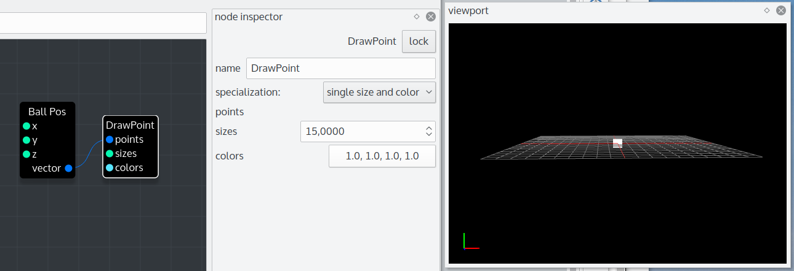
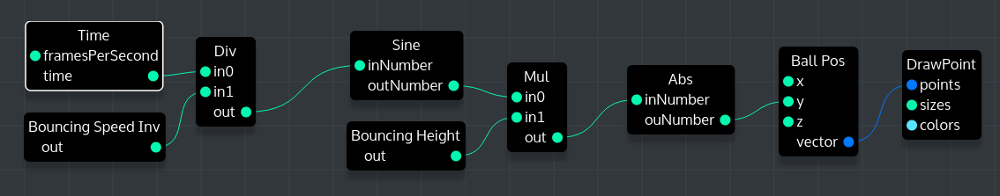
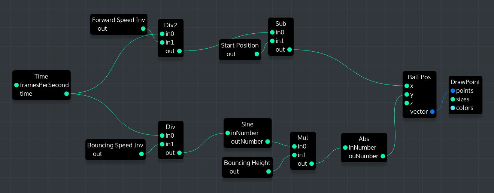

# Live Programming Seminar
- Your Name: Tim Henning
- Your Topic: Coral

> Generally try to drill down on reasons behind properties of the system. Make use of the general observations about the system in arguing about specific properties or mechanisms.

## About the System itself
> Summary of system properties

Coral is a visual programming environment mainly developed for CGI artists. It follows a node-based approach and can be used to manipulate the individual parts (vertices, edges) of geometrical objects in parallel but is also able to do so called pipeline work (i.e. rename files). The technical base could also be used to do number crunching tasks or database operations in scientific contexts with the benefit of automatic and transparent parallelism but this has not yet been done in practice.

The name Coral is used for a standalone application with a node editor and a live 3D preview, a Maya plug-in and a C++ library. In this report only the standalone application is considered, as it provides the same live programming features as the Maya plug-in in but is easier to install. Because there is no othern known project that uses the underlying C++ "Coral" library it is acceptable to speak of Coral as the standalone app or Maya plug-in.

### System boundaries
> What have you looked at exactly? Mention the boundaries of the system and state what is included and excluded. For example, in Chrome the system might be the developer tools. This ignores any JavaScript libraries which might add additional live capabilities to the tools or to the page currently developed. Another example are auto-testing setups which span a particular editor, testing framework, and auto-testing tool.

The subject of this report is the standalone Coral application in version 0.3.
Only the very basic built-in nodes are considered as the other nodes don't add any more new live aspects and would make the mechanisms more difficult to understand.

### Context
>   - In which context is the system used?
For example: Application development (coding, debugging, exploration), education, art, science (data exploration), simulation, exploration of ideas or data.
- Description of user context (professional, amateur, public presentation in front of audience, (un)known requirements, children, ...)

Coral is used for different tasks in a  3D / CGI studio, for example the deformation of 3D models, replication of models in specific patterns ("Crowd Instancing") and the creation of animations. Another totally different usecase is the creation of so called pipeline tools, that are used for example to transfer artefacts from one production step to another.

Coral is used only by professional 3D artists and pipeline technical directors (TD). They know the terminology and typical CGI workflow which means the program doens't have to focus on being easy to understand.

Requirements to the system are dependability and performance because of its use in a professional environment and the large datasize of models and textures. The most important requirement to use Coral for pipeline tools is comprehensibility to be able to make complex pipeline task understanble for all artists in the studio and not just the technical director that created the tool.

### General Application Domain
> - What is typically created in or through this system?
- What are users trying to accomplish with it?
- What kind of systems are modified or developed with it (graphical application, client-server architecture, big data, streaming)?
- ...

**TODO**

* Coral is development and runtime environment at the same time:
* the node-networks are created in the application and then directly used to complete a single task (like creating a geometry) or to be a permanent part of a data pipeline (i.e. for interactions in Maya)
* the node network can be modified while it is executed -> this is the live programming aspect that will be analysed
* ?

### Design Goals of the System
> What is the design rational behind the system? Which values are supported by the system? Which parts of the system reflect this rational? For example, auto-testing setups are designed to improve productivity by improving the workflow for TDD through providing feedback on the overall system behavior during programming. Smalltalk systems are designed for expressiveness and enabling understanding through allowing users to directly access and manipulate all runtime objects in the system.

There are many so called pipeline tasks in a computer graphics design studio. These task consist of multiple steps that modify a dataset like a geometrical model and often spread across different applications. The goal of Coral is to visualize this process and to make it easy to change parts of the pipeline and directly see the changes in the result.

**Design Rationals:**
* adjustements should be immediately visible
* complex logical and math operations should be easier to understand through the use of simple nodes
* changes to the node network should be possible at every time and without any compilation step
* pipeline work should be more comprehensable and easier to adjust to changing requirements

**Values:**
* increase performance of model deformations
* decrease duration needed for single production steps by eliminating the need to code and by increasing the efficiency by using transparent multithreading

**Parts reflecting this:**
* Comprehensability and changability through **dataflow architecture** with nodes and connections
* automatic and transparent multithreading by using **Intel TBB** and **"slicing"** (splitting large operations in multiple small ones)
* making changes instantly visible with the **live preview**

### Type of System
> What is the general nature of the system? For example: interactive tool, system, library, language, execution environment, application. What makes the system part of that category?

Coral is an interactive node-based tool with a graphical user interface meant for use by 3D artists and developers. It is part of the dataflow category.

## Workflows
Summary of workflow observations

### Example Workflow
> Description of the major workflow which illustrates all relevant "live programming" features. The workflow description should cover all major elements and interactions available. Augmented by annotated pictures and screencast.

The following workflow will describe how to create a "bouncing ball" with Coral. This doesn‘t seem to be a typical application but it could be used to animate the position of given 3D model that falls to the floor in the scene.

1. First we will add a "Vec3" node from the left panel by dragging it to the node editor area in the middle. This will be our ball position.
2. Then we add a "DrawPoint" node and connect the output of the previous added Vec3 node with the “points” input of the DrawPoint node. Now we should be able to see a small point in the center of the “viewport” window.
3. To make the point bigger we can just click on the DrawPoint node and increase the “sizes” value in the node inspector on the right. The point should immediately appear bigger.

   The node network (left), inspector and viewport should now look like in the following screenshot:

   

   This is already describes most of the major aspects of live programming in Coral. Nodes can be added at any time to the node editor and in the same moment when they are connected to the existing node network the changes become visible. Changing a value in the node inspector is shown live if the user uses the spinbox arrows or as soon as the user hits the enter key after typing in a new value.

   At the moment we only see a static point. To make it bounce we need to animate the y-position.

4. To create an animation, we need a “Time” node. It outputs the time as the number of frames since the start of the animation.
5. Add a “Div” node and connect the Time node to the top and a new “Float” node to the bottom. The current frame number is now divided by the float value so that the float value is the inverse speed of the ball. Set it to 8 in the node inspector on the right after clicking on the node.
6. Add a “TrigonometricFunc” node and connect it to the output of the “Div” node. Set it to “Sin” in the node inspector and add a “Mul” node to the output. Add a “Float” node to the other input of the “Mul” node. With this float value we can change the maximum height of the bouncing ball. Set it to 5.
7. Connect the output of the “Mul” node to the y-input of the ball position Vec3 node. We can now already see the ball moving up and down, though it doesn’t bounce off the floor but travels through it instead.
8. To make the ball seem to bounce on the floor we can just use the absolute value of the position by inserting a “Abs” node between the “Mul” node and the y-input of the Vec3 node.

   The node network now looks like this:

   

   In the last step we can see how easy it is to change the node network and that we can instantly see the results. This is an important “live programming” aspect in Coral.

   The ball is now bouncing off the floor (without any friction of course).
To see if Coral has an immutable or mutable past, we could now animate the x-position, too, so that the ball is slowly moving from left to right.

9. Add a “Div” node, connect it to the Time node (an output can be connected to multiple inputs) and to a new Float node. The Float value is the inverse speed of forward movement of the ball. Set it to 30.
10. Add a “Sub” node, connect it to the Div node from step 9 and to another new Float node. This Float value is the start position of the ball as an offset from the viewport origin. Set it to 10.
11. Connect the output of the “Sub” node to the x-input of the ball position Vec3 node.

   We just added the top part of the network in the following screenshot:

   

   The ball is now moving slowly from left to right while bouncing off the floor.

**Mutable or Immutable Past?**

If we wait till the ball is on the right side of the viewport and then set the speed of the forward movement lower, the ball doesn’t just move slower from its previous position on but is now back in the middle of the screen. This shows that in this particular setup we have a mutable past.

### Which activities are made live by which mechanisms?
> Description of each concrete activity in the workflow and the underlying liveness mechanism (which is described on a conceptual level and thus could be mapped to other systems)
- Actual interactions
- Feedback mechanism
- If applicable: How is the emergence phase shortened?
- Granularity: For example: Elm can only rerun the complete application

The main mechanism to provide liveness in Coral is its dataflow architecture.
This means that changing a value in one node of the node network instantly 
affects all the nodes connected to its output. In general the change is forwarded in the network till it reaches a node without outputs.

Activities:

* Adding Nodes
  * Actual Interactions: Dragging a node from the list of nodes to the node network
  * Feedback Mechanism: Showing node in the GUI
  * Emergence Phase shortened somehow: no
  * Granularity: other nodes are not affected
  * Mechanism: creating an instance of the block and adding it to the network; if the node has any “initialization” functions, they are immediately executed
* Removing Nodes
  * Actual Interactions: removing a node by selecting it and hit delete
  * Feedback Mechanism: Hiding node in the GUI; when removing a node that is still connected, the connections are removed and the network is reevaluated without it
  * Emergence Phase shortened somehow: no
  * Granularity: Only the nodes connected to the node that is removed are reevaluated
  * Mechanism: removing all connections (and by that reevaluating the other nodes without it) and deleting the nodes instance
* Connecting Nodes
  * Actual Interactions: click and hold on the output of a node and release the click above the input of another node
  * Feedback Mechanism: Drawing the line red and showing a tooltip if the output has the wrong data type; otherwise drawing the previously dotted line normal
  * Emergence Phase shortened somehow: no
  * Granularity: Only connected nodes are reevaluated
  * Mechanism: applying the value of the output to the input and reevaluating the rest of the network
* Changing a value in the node inspector
  * Actual Interactions: select a node by clicking on it and changing a value in the node inspector either with a spinbox or by typing the new value and hitting enter
  * Feedback Mechanism: immediately showing the result i.e. in the viewport
  * Emergence Phase shortened somehow: no
  * Granularity: Only connected nodes are reevaluated
  * Mechanism: applying the value reevaluating the rest of the network

### Integration of live activities into overall system
> Which activities in the system are not interactive anymore? Which elements can be manipulated in a live fashion and which can not?

> How does this workflow integrate with other parts of the system (potentially not live)? What happens at the boundaries between live parts and non-live parts? For example, the interactively assembled GUI is later passed to a compiler which creates an executable form of the GUI.

Everything is live: Adding and removing nodes or connections, changing 
values, even collapsing multiple nodes to one “super” node.

### Limitations
> To which extend can the liveness of one activity be kept up? For example, at which magnitude of data flow nodes does the propagation of values become non-immediate? At which magnitude of elapsed time can the Elm debugger not replay the application immediately anymore or when does it break down? Does an exception break the liveness?
Further, what are conceptual limitations. For example, in a bi-directional mapping system properties of single elements might be modified and reflected in the code. This might not be possible for properties of elements created in loops.

**TODO**

Performance? Max. size of geometries? Max amount of nodes / connections?

### What happens when the live parts of the system fail/break?
> 1. What happens when the application under development causes an exception? How does the system handle these exceptions (provide debugger, stop execution, stop rendering, ...)? Does the liveness extend to these exceptions?

**TODO**

Prevent connecting wrong datatypes and showing a helpful tooltip

> 2. How can the system itself break? What happens when there is a failure in the system/tool itself?

**TODO**

Fault Injection?

### Left out features
> Which features of the system were not described and why were they left out?

**TODO**

Coral C++ Library, Maya Integration, Geometries, Textures, Kernel Node, Audio Node

---

## Models

### Mutable or immutable past
To which category does the system or parts of it belong and why?

Because of its dataflow design Coral belongs to the **Immutable Past** category. Changing a value or adding a node only influences the current state of the node network and is not affected for example by previous user input.

Interestingly there is the possibility to create systems *in* Coral that show indications of a **Mutable Past**. An example for this is the bouncing ball in the example workflow that is created by using only time-dependent functions. After changing the speed of the ball it doens't continue from its current positon but jumps to where it would have been if the speed was like that from the beginning on.

*P. Rein and S. Lehmann and Toni & R. Hirschfeld How Live Are Live Programming Systems?: Benchmarking the Response Times of Live Programming Environments Proceedings of the Programming Experience Workshop (PX/16) 2016, ACM, 2016, 1-8*

### Tanimoto's Level of Live Programming
> To which level of liveness do single activities belong, based on the definitions of the 2013 paper and why?

All activities in Coral belong to Tanimoto Level 4. There is no perceivable lag between changing a value or connecting nodes and seeing the results. There are no compilation steps involved, the node network is created as a hierarchy of C++ objects at runtime.

*S. L. Tanimoto A perspective on the evolution of live programming Proceedings of the 1st International Workshop on Live Programming, LIVE 2013, 2013, 31-34*

### Steady Frame
> Which activities are designed as steady frames based on the formal definition and how?

The whole application is designed as a steady frame. All active nodes are always visible (except they are collapsed, but then the collapsed node is visible). The values of the nodes are accessable within one click and then shown in the node browser. The values are always up-to-date / meaningful (at least when the user hits the enter key). The live preview is also always up-to-date and doesn’t need an explicit refresh by the user.

*C. M. Hancock Real-Time Programming and the Big Ideas of Computational Literacy Massachusetts Institute of Technology, Massachusetts Institute of Technology, 2003*

### Impact on distances
> How do the activities affect the different distances: temporal, spatial, semantic?

**Temporal:** The fact that every operation is instantly executed and its results visible within one frame decreases the temporal distance to a minimum. There is no conscious effort needed to understand the causality of an action and its reactions.

**Spatial:** The spatial distance can be quit large in Coral. A change in the node network on the left of the screen can result in a different model displayed in the viewport on the right of the screen that is barely visible. Changes could also result in different values that are only shown in the node inspector after selecting the right node.

**Semantic Distance:** To understand which value affects which part of the model can be very hard even for professional CGI artists and developers. There is no mechanism in Coral to decrease the semantic distance for example with matching colors of a value and its affected parts in the model. This means the semantic distance is higher than it should be and could be enhanced.

**Perspective:** The visualization of the model in the viewport is well suited for this application domain. It is not only a table of meaningless values or a 2D projection of the model but the way the model will later be renderen, only without textures and lighting.

*D. Ungar and H. Lieberman & C. Fry Debugging and the Experience of Immediacy Communications of the ACM, ACM, 1997, 40, 38-43*

---

## Implementing Liveness

### Extend of liveness in technical artifacts
> What parts of the system implements the liveness? (Execution environment, library, tool...)

The liveness is implemented in the Coral C++ library (it is the runtime environment of the application) and in the Coral Standalone GUI (i.e. the node inspector that allows chaning object properties at runtime).

### Implementations of single activities
> Description of the implementation of live activities. Each implementation pattern should be described through its concrete incarnation in the system (including detailed and specific code or code references) and as an abstract concept.

> #### Example: Scrubbing
> The mouse event in the editor is captured and if the underlying AST element allows for scrubbing a slider is rendered. On changing the slider the value in the source code is adjusted, the method including the value is recompiled. After the method was compiled and installed in the class, the execution continues. When the method is executed during stepping the effects of the modified value become apparent.

> Abstract form: Scrubbing is enabled through incremental compilation which enables quick recompilation of parts of an application...

**TODO:**

#### Adding a Node

**Concrete:**

A node can be added at anytime to the node network and is instantly visible and working.

Adding a node is done by double-clicking on it in the 'Node Box'.
As the node box is implemented in Python, the first code that is executed is this Python function:

```python
# coralUi/py/coralUi/nodeBox.py lines 152-155:
newNodeName = coralApp.executeCommand("CreateNode",
                                                className = className,
                                                name = className,
                                                parentNode = parentNode)
```

'coralApp.execute()' is used to achieve loose coupling between the UI components and the application logic. The new node is then instatiated by the Python function '_instantiateNode()':

```python
# coral/py/coral/coralApp.py lines 370-400:
def _instantiateNode(className, name, parent):
    coralNodeClass = findNodeClass(className)
    
    coralNode = None
    if coralNodeClass.__dict__.has_key("createUnwrapped"):
        coralNode = coralNodeClass.createUnwrapped(name, parent)
    else:
        coralNode = coralNodeClass(name, parent)

    # [...]

    coralNode._postInit()
    
    parent.addNode(coralNode)
    
    if hasattr(coralNode, "postInit") and CoralAppData.loadingNetwork == False:
        coralNode.postInit()
    
    # [...]
    
    return coralNode
```

The function 'findNodeClass()' in the first line ensures that new node types can be added at runtime (i.e. as a plugin). It returns the name of the corresponding class (that could be implemented in Python or C++ with an automatic Python wrapper) and that is then instatiated.

At the end of the method an initialization function is called. This is one of the parts where the 'liveness' comes from because the node could run actions exactly at the moment when it is created and doesn't require the user to click on 'start' button in the user interface.
After that the node is added to its parent node (the nodes are organized hierarchically to be able to collapse and expand them).

To get a better idea what happens when a node class is instantiated and how the live 'type conversion' works, here is a  typical class declaration and the implementation of the constructor of a C++ Node:

```c++
// coral/builtinNodes/MathNodes.h lines 131-140:
class TrigonometricFunctions: public Node{
public:
	TrigonometricFunctions(const std::string &name, Node *parent);
	void updateSlice(Attribute *attribute, unsigned int slice);

private:
	NumericAttribute *_inNumber;
	NumericAttribute *_outNumber;
	EnumAttribute *_function;
};
```

```c++
// coral/builtinNodes/MathNodes.cpp lines 500-577:
TrigonometricFunctions::TrigonometricFunctions(const std::string &name, Node *parent): Node(name, parent){
	setSliceable(true);

	_inNumber = new NumericAttribute("inNumber", this);
	_outNumber = new NumericAttribute("outNumber", this);
	_function = new EnumAttribute("func", this);

	addInputAttribute(_inNumber);
	addInputAttribute(_function);
	addOutputAttribute(_outNumber);

	setAttributeAffect(_inNumber, _outNumber);
	setAttributeAffect(_function, _outNumber);

	std::vector<std::string> specialization;
	specialization.push_back("Float");
	specialization.push_back("FloatArray");

	std::vector<std::string> funcSpecialization;
	funcSpecialization.push_back("Int");

	setAttributeAllowedSpecializations(_inNumber, specialization);
	setAttributeAllowedSpecializations(_outNumber, specialization);
	
	addAttributeSpecializationLink(_inNumber, _outNumber);
	
	Enum *func = _function->outValue();
	func->addEntry(0, "cos");
	func->addEntry(1, "sin");
	func->addEntry(2, "tan");
	func->addEntry(3, "acos");
	func->addEntry(4, "asin");
	func->addEntry(5, "atan");
	func->addEntry(6, "cosh");
	func->addEntry(7, "sinh");
	func->addEntry(8, "tanh");
}
```

The line 'setAttributeAllowedSpecializations(...)' shows that the allowed value types of the node are declared at runtime and that no single type is hardcoded at compiletime. This enables the application to present the user a list of possible value types in the UI and makes it possible to change the value types 'live' by selecting them in the Node Inspector.

The last code part shows how the UI of the node is created live at runtime by iterating over the attributes and adding corresponding UI elements:

```python
# coralUi/py/coralUi/nodeEditor/nodeUi.py lines 143-170:
    def buildFromCoralNode(self):
        coralNode = self._coralNode()
        self._label.setText(coralNode.name())
        
        self._clearAttributeUis()
        
        attrs = []
        for attribute in coralNode.inputAttributes():
            attributeUi = nodeEditor.NodeEditor._createAttributeUi(attribute, self)
            self.addInputAttributeUi(attributeUi)
            
            attrs.append(attributeUi)
            
        for attribute in coralNode.outputAttributes():
            attributeUi = nodeEditor.NodeEditor._createAttributeUi(attribute, self)
            self.addOutputAttributeUi(attributeUi)
            
            attrs.append(attributeUi)
        
        # [...]
                
        self.updateLayout()

```

**Abstract:**

A Node is added live to the exisiting node network by creating an object of the corresponding class, calling its initialization function, adding it to the parent node and dynmically creating a UI for it.

#### Removing a Node

**Concrete:**

Deleting a node can be done by selecting it and then pressing 'delete'. The live aspect when deleting a node is, that the connections to other nodes are removed, the node network reevaluated without them and the new result is immediately visible.

The deletion starts in the Python method 'deleteIt()' that is called on the node itself. This method calls the delete functions of all child nodes and removes itself from the parent node. The interesting part is the call of the delete function of the attributes of the node.

```python
# coralUi/py/coralUi/nodeEditor/nodeUi.py lines 385-405:
    def deleteIt(self):
        if self.isSelected():
            nodeEditor.NodeEditor._setSelectedNodes([])
        
        if self._nodeViewWatching:
            parentNodeUi = self.parentNodeUi()
            if parentNodeUi:
                self._nodeViewWatching().setCurrentNodeUi(parentNodeUi)
        
        attrs = copy.copy(self._attributeUis)
        for attr in attrs:
            attr.deleteIt()
        
        nodes = copy.copy(self._nodeUis)
        for node in nodes:
            node.deleteIt()
            
        self.setParentNodeUi(None)
        
        if nodeEditor.NodeEditor._nodeUis.has_key(self._coralNodeId):
            del nodeEditor.NodeEditor._nodeUis[self._coralNodeId]
```

The following code snippet shows the delete function of an attribute. Attributes are an important part of the architecture of Coral because all adjustable values of a node are represented as objects of a class inheriting from Attribute and the connections between nodes are modeled as connections between those attributes. So when a node is deleted the connections are removed in the delete functions of the attributes. This is where the 'liveness' is implemented because the call of 'disconnectInput()' / 'disconnectOutput()' results in a reevaluation of the connected nodes.

```c++
// coral/src/Attribute.cpp lines 494-533:
void Attribute::deleteIt(){
	if(_deleteItCallback && !isDeleted()){
		_deleteItCallback(this);
	}
	
	if(parent()){
		parent()->removeAttribute(this);
	}
	
	if(_input){
		disconnectInput();
	}
	
	std::vector<Attribute*> oldAffect = _affect;
	for(std::vector<Attribute*>::iterator itAffect = oldAffect.begin(); itAffect != oldAffect.end(); ++itAffect){
		removeAffect(*itAffect);
	}
	
	std::vector<Attribute*> oldAffectFrom = _affectedBy;
	for(std::vector<Attribute*>::iterator itAffect = oldAffectFrom.begin(); itAffect != oldAffectFrom.end(); ++itAffect){
		(*itAffect)->removeAffect(this);
	}
	
	std::vector<Attribute*> oldOutputs = _outputs;
	for(std::vector<Attribute*>::iterator itOutput = oldOutputs.begin(); itOutput != oldOutputs.end(); ++itOutput){
		disconnectOutput(*itOutput);
	}
	
	std::vector<SpecializationLink*> oldSpecializationLinks = _specializationLinks;
	for(std::vector<SpecializationLink*>::iterator itSpecializationLink = oldSpecializationLinks.begin(); itSpecializationLink != oldSpecializationLinks.end(); ++itSpecializationLink){
		removeSpecializationLink(*itSpecializationLink);
	}
	
	if(_value){
		_value->removeReference();
		_value = 0;
	}
	
	setIsDeleted(true);
}
```

**Abstract:**

Nodes are removed by disconnecting all attributes from other nodes and removing it from its parent. Only the nodes that were connected are reevaluated.


#### Connecting Nodes

**Concrete:**

```c++
// coral/src/Attribute.cpp lines 456-480:
bool Attribute::connectTo(Attribute *attribute, ErrorObject *errorObject){
	_outputs.push_back(attribute);
	attribute->setInput(this);
	
	cacheEvaluationChain();
	
	bool resetBranchSpecialization = false;
	bool success = updateBranchSpecializations(resetBranchSpecialization);
	
	if(parent()){
		parent()->_attributeConnectionChanged(this);
	}
	
	if(attribute->parent()){
		attribute->parent()->_attributeConnectionChanged(attribute);
	}
	
	if(_connectToCallback && !isDeleted())
		_connectToCallback(this, attribute);
	
	bool forceDirty = true;
	attribute->dirty(forceDirty);
	
	return success;
}
```

```python
# coralUi/py/coralUi/nodeEditor/attributeUi.py lines 128-141:
    def connectTo(self, attributeUi):
        startHook = self._outputHook
        endHook = attributeUi.inputHook()
        
        if endHook is None:
            proxy = attributeUi.proxy()
            if proxy:
                endHook = proxy.inputHook()
        
        if startHook is None:
            if self._proxy:
                startHook = self._proxy().outputHook()
        
        Connection(startHook, endHook)
```

```c++
// coral/builtinNodes/MathNodes.cpp lines 538-577:
void TrigonometricFunctions::updateSlice(Attribute *attribute, unsigned int slice){
	std::vector<float> inValues = _inNumber->value()->floatValuesSlice(slice);
	int inFunction = _function->value()->currentIndex();
	std::vector<float> outValues(inValues.size());

	for(int i = 0; i < inValues.size(); ++i){
		switch(inFunction)
		{
		case 0:
			outValues[i] = cos(inValues[i]);
			break;
		case 1:
			outValues[i] = sin(inValues[i]);
			break;
		case 2:
			outValues[i] = tan(inValues[i]);
			break;
		case 3:
			outValues[i] = acos(inValues[i]);
			break;
		case 4:
			outValues[i] = asin(inValues[i]);
			break;
		case 5:
			outValues[i] = atan(inValues[i]);
			break;
		case 6:
			outValues[i] = cosh(inValues[i]);
			break;
		case 7:
			outValues[i] = sinh(inValues[i]);
			break;
		case 8:
			outValues[i] = tanh(inValues[i]);
			break;
		}
	}

	_outNumber->outValue()->setFloatValuesSlice(slice, outValues);
}
```

**Abstract:**


#### Removing Conncetions

**Concrete:**


**Abstract:**


#### Changing a Value in the Node Inspector

**Concrete:**

```python
# coralUi/py/coralUi/nodeInspector/fields.py lines 86-96:
    def widgetValueChanged(self):
        value = self.getWidgetValue(self.valueWidget())
        somethingChanged = False
        for sourceAttr in self._sourceAttributes:
            attr = sourceAttr()
            if self.getAttributeValue(attr) != value:
                self.setAttributeValue(attr, value)
                somethingChanged = True
        
        if somethingChanged:
            self.coralObject().forceDirty()
```

**Abstract:**


### Within or outside of the application
> For each activity: Does the activity happen from within the running application or is it made possible from something outside of the application? For example, a REPL works within a running process while the interactions with an auto test runner are based on re-running the application from the outside without any interactive access to process internal data.

All liveness is implemented within the application (either C++ lib or Standalone GUI). Development and Runtime Environment is the same.
The Maya Plugin adds liveness to Maya from the outside.

---

## Benchmark
1. **Unit of change:** Determine relevant units of change from the user perspective. Use the most common ones.
2. **Relevant operations:** Determine relevant operations on these units of change (add, modify, delete, compound operations (for example refactorings)).
3. **Example data:** Select, describe, and provide representative code samples which reflect the complexity or length of a common unit of change of the environment. The sample should also work in combination with any emergence mechanisms of the environment, for example a replay system works well for a system with user inputs and does not match a long-running computation.
4. **Reproducible setup of system and benchmark**
1. Description of installation on Ubuntu 16.04.1 LTS
2. Description of instrumentation of system for measurements: The measurements should be taken as if a user was actually using a system. So the starting point of a measurement might be the keyboard event of the save keyboard shortcut or the event handler of a save button. At the same time the emergence phase ends when the rendering has finished and the result is perceivable. The run should include all activities which would be triggered when a developer saves a unit of change (for example regarding logging or persisting changes).
5. **Results for adaptation and emergence phase**

*P. Rein and S. Lehmann and Toni & R. Hirschfeld How Live Are Live Programming Systems?: Benchmarking the Response Times of Live Programming Environments Proceedings of the Programming Experience Workshop (PX/16) 2016, ACM, 2016, 1-8*

---

## Personal observations
Everything that is particular about the environment and does not fit into the pre-defined categories mentioned so far.

## Style Template
- Denote headings with #
- You can use any text highlighting, list types, and tables
- Insert images in the following way:
``
- Insert videos or web resources as markdown links
- Insert references as: `@RefKey` and supply a bib file
- No HTML tags please
