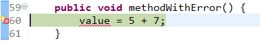
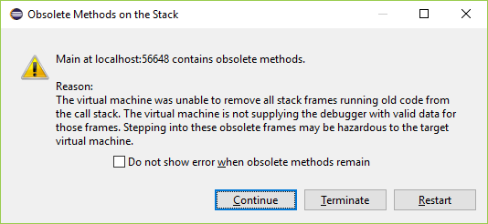

# Live Programming Seminar
- Your Name: Daniel Stolpe
- Your Topic: Eclipse Java debugger

*Generally try to drill down on reasons behind properties of the system. Make use of the general observations about the system in arguing about specific properties or mechanisms.*

## About the System itself
*Summary of system properties*
Eclipse provides IDEs and platforms for many languages and architectures. Eclipse is famous for their Java IDE, C/C++, JavaScript and PHP IDEs built on extensible platforms for creating desktop, Web and cloud IDEs. The Eclipse IDEs are open-source. @RefKey[EclipseOrg]
Eclipse was inspired by the Smalltalk-based VisualAge family of IDEs. @RefKey[EclipseFAQWhereFrom]
The Eclipse Project was originally created by IBM in November 2001 and supported by a consortium of software vendors. The Eclipse Foundation was created in January 2004 as an independent not-for-profit corporation to act as the steward of the Eclipse community. @RefKey[EclipseOrgOrg]

### System boundaries
*What have you looked at exactly? Mention the boundaries of the system and state what is included and excluded. For example, in Chrome the system might be the developer tools. This ignores any JavaScript libraries which might add additional live capabilities to the tools or to the page currently developed. Another example are auto-testing setups which span a particular editor, testing framework, and auto-testing tool.*
We are focusing on the Java Debugger of the Eclipse Java IDE. The Java Debugger is part of the "Java Development Tools (JDT) Debug" project. It is implemented on top of the language independent "debug model" provided by the platform debugger which provides language independent facilities for launching programs, source code lookup, breakpoints and debugging UI. @RefKey[EclipseDebug]
We use Java 1.8.0 update 112 as Virtual Machine for running Eclipse itself and the sample application we develop.

### Context
  - In which context is the system used?
    *For example: Application development (coding, debugging, exploration), education, art, science (data exploration), simulation, exploration of ideas or data.*
    The Eclipse Java debugger is used for debugging Java applications during development within Eclipse or debugging arbitrary Java applications remotely.
     
  - Description of user context (professional, amateur, public presentation in front of audience, (un)known requirements, children, ...)
    The Eclipse Java debugger or the Eclipse Java IDE is not used by a specific user group. Amateurs and students use it to learn coding, professional developers use it to build small and large scale applications. Especially for unexperienced developers, the IDE is useful to immediately see syntactical errors and suggestions on how to fix them. Also code completion features help to explore and find classes and methods. The debugger is useful for every user group to understand and debug runtime behavior.

### General Application Domain
There are different Eclipse IDEs for different programming languages and different purposes. Mainly, these IDEs are used to build desktop, Web and Cloud applications. The Eclipse Java Debugger is used to support the creation of these applications by providing a graphical debugger.

### Design Goals of the System
*What is the design rational behind the system? Which values are supported by the system? Which parts of the system reflect this rational? For example, auto-testing setups are designed to improve productivity by improving the workflow for TDD through providing feedback on the overall system behavior during programming. Smalltalk systems are designed for expressiveness and enabling understanding through allowing users to directly access and manipulate all runtime objects in the system.*
Eclipse is a community for individuals and organizations who wish to collaborate on commercially-friendly open source software. Its projects are focused on building an open development platform comprised of extensible frameworks, tools and runtimes for building, deploying and managing software across the lifecycle. An important aspect of Eclipse is the focus on enabling the use of open source technology in commercial software products and services. @RefKey[EclipseOrgOrg]

### Type of System
*What is the general nature of the system? For example: interactive tool, system, library, language, execution environment, application. What makes the system part of that category?*
The Eclipse Java Debugger is an interactive debugger which provides the following debugging functionality @RefKey[EclipseDebug]:

  - Launching of a Java VM in either run or debug mode
  - Attaching to a running Java VM
  - Expression evaluation in the context of a stack frame
  - Scrapbook pages for interactive Java code snippet evaluation
  - Dynamic class reloading where supported by Java virtual machine (since Java 1.4)

---

## Workflows
Writing code in Eclipse is supported by syntax highlighting, code completion and lots of other feedback mechanisms to detect syntactical errors. The views and tools are pluggable so that you can adjust the IDE to your needs. When debugging, the Eclipse Debugger provides some liveness features to replace code of methods and lots of different ways to inspect runtime state. These features are mainly used to find bugs faster, but not to develop applications at runtime. In following exemplary workflow, we try to develop the application as live as possible, keeping the application running as long as possible while writing the source code.

### Example Workflow
*Description of the major workflow which illustrates all relevant "live programming" features. The workflow description should cover all major elements and interactions available. Augmented by annotated pictures and screencast.*

A good example to demonstrate live programming features and its limitations is creating a bouncing ball simulation with Java 2D drawing features.

1. We start Eclipse (in this test case Neon.1a Release (4.6.1))
2. We choose from the menu bar "File" > "New" > "Java Project"
3. We choose a project name, e.g. "BouncingBall" and click "Finish"
4. In the "Package Explorer" we right-click on our new project "BouncingBall" and choose "New" > "Class". In the opening Dialog we enter the name "Main" and select the checkbox "public static void main(String[] args)" and click "Finish"
5. We add three more classes, but leaving the checkbox for creating a main method unchecked. The classes are "Ball", "BallPanel" and "BallDialog"
6. We select the class "Ball" and add some fields and methods to it by adjusting (in the following, "adjusting" always is writing the code and saving the changes by pressing *Ctrl+S*) the code like this:
```java
import java.awt.Color;
import java.awt.Graphics;
import java.awt.Point;

public class Ball {
  private Point location;
  private int radius;
  private Color color;

  public Ball(Point l){
      location = l;
      color = Color.RED;
      radius = 16;
  }

  public Point getLocation() {
      return location;
  }

  public int getRadius() {
      return radius;
  }

  public Color getColor() {
      return color;
  }
}
```

7. Now we want to draw a ball, so we need some code to create a Window in Java. We adjust the class "Main" to:
```java
import javax.swing.JFrame;

public class Main {

  public static void main(String[] args) {
      javax.swing.SwingUtilities.invokeLater(new Runnable() {
          public void run() {
              createAndShowGUI();
          }
      });
  }
  
  private static void createAndShowGUI() {
      JFrame frame = new JFrame("Bouncing ball");
      frame.setDefaultCloseOperation(JFrame.EXIT_ON_CLOSE);
      
      BallPanel ballPanel = new BallPanel();
      ballPanel.setOpaque(true);
      frame.setContentPane(ballPanel);

      frame.pack();
      frame.setLocationRelativeTo(null);
      frame.setVisible(true);
  }
}
```

8. We also adjust the class "BallPanel" to:
```java
import java.awt.Dimension;
import java.awt.Point;
import javax.swing.JPanel;

public class BallPanel extends JPanel {
  private Ball ball;
  
  public BallPanel() {
    setPreferredSize(new Dimension(600, 400));
    ball = new Ball(new Point(50,50));
  }
}
```

9. We right-click on the class "Main" and select "Debug As" > "1 Java Application". A Window opens, but no ball is visible yet.
10. We need to add the actual drawing methods, so keeping the window open, we switch to the Eclipse IDE and add the following method to "BallPanel":
```java
  @Override
  public void paint(Graphics g){
      super.paint(g);
      ball.paint(g);
  }
```
"Graphics" is unknown to the compiler, so we press *Ctrl+Shift+O* to organize our imports and select "java.awt.Graphics". We save our changes which leads to the following pop-up:

We click "Terminate", because we need to add more methods. We need to implement the paint-method for the class "Ball". We hover with the mouse cursor over the red-underlined code snippet "ball.paint(g);" and select from the displayed pop-up "Create method ...". Now we can add the following code to the auto generated method and save the changes:
```java
  g.setColor(getColor());
  g.fillOval(100, 100, 50, 50);
```

11. We run the application again in Debug-mode by pressing "F11". Now, the ball is drawn:

We want to adjust the `paint(...)` method, so that the actual properties of the ball are used to draw and not the hard coded values. So we keep the window open again and switch to the IDE. We change the "paint"-method to:
```java
  g.setColor(getColor());
  g.fillOval(location.x - radius, location.y - radius, 2 * getRadius(), 2 * getRadius());
```
We save and switch to our ball-window. We can not see any change, because the paint method was not triggered again yet. We enforce a repaint by grabbing the edge of the window with the mouse and make it a bit larger. Now we see the ball changing in size and position.

12. We want to make the ball start moving and adjust the "BallPanel" code to:
```java
[...]
public BallPanel() {
    setPreferredSize(new Dimension(600, 400));
    ball = new Ball(new Point(50,50), 8, 2);
    
    new Thread(new Runnable() {
      @Override
      public void run() {
        while (true) {
          if (BallPanel.this.getParent().isVisible()) {
            BallPanel.this.stepTheBall();
          }

          try {
            Thread.sleep(20);
          } catch (InterruptedException e) {
            e.printStackTrace();
          }
        }
      }
  }).start();
}
  
public void stepTheBall() {
  ball.move();
  repaint();
}

[...]
```
When saving, the notification pops up again, that Hot Code Replace is not possible. We terminate the running application.
We adjust the code of "Ball" to:
```java
[...]
public class Ball {
  private Point location;
  private int radius;
  private int dx, dy;
  private Color color;

  public Ball(Point l, int directionX, int directionY){
      location = l;
      color = Color.RED;
      radius = 16;
      dx = directionX;
      dy = directionY;
  }

  public void move(){
      getLocation().translate(dx, dy);
  }

[...]
```

13. We run the application again in Debugging-mode by pressing "F11". We see the ball moving from the top left corner, to the right and leaving the window. To bounce the ball from the right side, we adjust the "stepTheBall"-method:
```java
public void stepTheBall() {
  ball.move();
  
  Point position = ball.getLocation();

  if (position.x > getWidth()) {
    ball.recflectVertical();
  }

  repaint();
}
```
After saving a pop-up appears:

We choose "Yes". In the Debug-Perspective we can hover over the red-underlined code snippet `ball.recflectVertical();` to get the info, that this method is missing in class "Ball". We click on "Create method ...". In the class "Ball", we implement the method as follows:
```java
public void recflectVertical() {
    dx = -dx;       
}
```
Saving leads again to the information that Hot Code Replace is not possible when adding methods. This time, we click "Restart". The ball bounces from the right side, but not from the others.

14. We add the remaining checks:
```java
public void stepTheBall() {
    ball.move();
    
    Point position = ball.getLocation();

    if (position.x > getWidth() || position.x < 0) {
      ball.recflectVertical();
    }

    if (position.y > getHeight() || position.y < 0) {
      ball.recflectHorizontal();
    }
    repaint();
}
```
and add `recflectHorizontal()` to "Ball":
```java
public void recflectHorizontal() {
    dy = -dy;       
}
```
Again we have to restart the application. Now the ball bounces from all sides.

15. The bouncing does not look very nice, because the reflection is done based on the top left corner of the ball. We adjust the code of `stepTheBall()` to:
```java
if (position.x + ball.getRadius() > getWidth() || position.x - ball.getRadius() < 0) {
  ball.recflectVertical();
}

if (position.y + ball.getRadius() > getHeight() || position.y - ball.getRadius() < 0) {
  ball.recflectHorizontal();
}
```
The changes are immediately visible without the need to restart.

16. Now, we want to change the direction vector of our ball, so that it moves very slow, but without terminating the application. We place a breakpoint in the method `move()` by double clicking next to the line number. The debugger immediately holds at the breakpoint:

We can hover over the variables `dx` and `dy` to view their current values:

We could also select `dx`, right-click the selection and click "Watch" in the context menu. This will open the "Expression View", where we can see the value of `dx`. Unfortunately we cannot change it.

To change the value of `dx`, we click on "Window" > "Show View" > "Variables" in the menu bar. In this view we expand "this" to see all fields of the current "Ball" instance:

Now we can double click into the "Value" column and change the value of `dx` to `1`. Then we remove the breakpoint by double clicking next to the line number in the editor and press "F8" to resume the execution.
The ball is moving very slow now.

17. Finally, we want to replace the single colored ball with an image of a football. We switch back to the "Java Perspective" and add a PNG image to our Java project's source folder named `ball.png`.

At the moment, we do not know exactly, how to load and draw an image in Java and want to try out some ideas. We switch back to the "Debug Perspective" and set a breakpoint at `g.setColor(getColor());` in method `public void paint(Graphics g)` of class `Ball.java`.
We press "F11" to start debugging.
The execution stops at our breakpoint. To get a scrapbook- or workspace-like environment, we click in the menu bar "Window" > "Show View" > "Display". In this view we have access to all variables available in the context of the current executed method. We type `g.` and get some code completion suggestions. We type `g.image` to find a method which can draw an image.

We decide on the fifth entry which needs an instance of `Image`, the drawing position and width and height of the image.
Now we need an instance of `Image`. We know that there is a class `ImageIO` which can read images. We type `ImageIO` and trigger code completion by pressing *Ctrl+Space* to get the full qualified name `javax.imageio.ImageIO` of the class. We trigger code completion again by typing `javax.imageio.ImageIO.read`. There is a method accepting an `InputStream`, which we will use.

To get an input stream for our image `ball.png` we can use the system class loader by typing `Ball.class.getResourceAsStream("ball.png")`. To test this code snippet, we select the whole line of code we want to execute and press *Ctrl+Shift+D*. The result is:

Now, that we have a valid input stream, we can test drawing an image. We combine our code snippets to `g.drawImage(javax.imageio.ImageIO.read(Ball.class.getResourceAsStream("ball.png")), 10, 10, null)`, select the line of code and press *Ctrl+Shift+D*.

The result is `(boolean) true` which means, that the drawing was successful. We switch to our running application but cannot see any image of a ball, because the actual drawing is not done yet. We press "F8" to continue execution. The program stops again at our breakpoint at `g.setColor(getColor());`. We switch again to our running application and now we see the image of the ball drawn at position (10, 10).

Now we can replace the actual drawing code of method `public void paint(Graphics g)` with `g.drawImage(javax.imageio.ImageIO.read(Ball.class.getResourceAsStream("ball.png")), location.x - radius, location.y - radius, 2 * getRadius(), 2 * getRadius(), null);`.
The code is not valid yet and by hovering over the red-line code we see that a try-catch-statement is needed. We add it by selecting "Surround with try/catch".

The drawing code looks like this:
```java
public void paint(Graphics g) {
  try {
    g.drawImage(javax.imageio.ImageIO.read(Ball.class.getResourceAsStream("ball.png")), location.x - radius, location.y - radius, 2 * getRadius(), 2 * getRadius(), null);
  } catch (IOException e) {
    e.printStackTrace();
  }
}
```
Now we remove the breakpoint, save our changes and press "F8" to resume execution. The application is still running and we can switch to it and see the bouncing image of a ball.


18. Now we want to show another tool, the "Scrapbook Page", which has not fit into the workflow shown above. It provides the same liveness features like the "Display View", but can be used as a standalone workspace to evaluate Java code. We click on "File" > "New" > "Other..." and in the wizard we select "Java" > "Java Run/Debug" > "Scrapbook Page" and click "Next". We enter a file name, e.g. "workspace" and click "Finish". An empty "Scrapbook Page" opens. We can enter arbitrary Java Code and evaluate it by selecting the code and pressing *Ctrl+Shift+D*.


### Which activities are made live by which mechanisms?
*Description of each concrete activity in the workflow and the underlying liveness mechanism (which is described on a conceptual level and thus could be mapped to other systems)
- Actual interactions
- Feedback mechanism
- If applicable: How is the emergence phase shortened?
- Granularity: For example: Elm can only rerun the complete application*

Step 11 of the example workflow shows the first liveness activity. The program is running in Debug-mode and we change code in the body of the `paint(...)` method. Saving these changes via the Eclipse Debugger triggers Hot Code Replace (HCR). The method body of the `paint(...)` is replaced without restarting the application. But the change is only visible when the `paint`-method is triggered e.g. by resizing the window.

**JAVA Hot Code Replace (HCR)**
At an Eclipse FAQ it is written:
> Hot code replace (HCR) is a debugging technique whereby the Eclipse Java debugger transmits new class files over the debugging channel to another JVM. In the case of Eclipse development, this also applies to the VM that runs the runtime workbench. The idea is that you can start a debugging session on a given runtime workbench and change a Java file in your development workbench, and the debugger will replace the code in the receiving VM while it is running. No restart is required, hence the reference to "hot".
HCR has been specifically added as a standard technique to Java to facilitate experimental development and to foster iterative trial-and-error coding. HCR is reliably implemented only on 1.4.1 VMs and later. @RefKey[EclipseFAQHCR]

The following schema shows what happens in step 11, when saving the changes.


**@Stefan/Patrick: Ist das Bild + HCR Erklärung schon Implementation detail und gehört weiter unten in den Abschnitt?**

In step 15, HCR is triggered again by saving a Java file. This change is immediately visible, due to stepping implemented via a separate Thread which enforces a repaint every 20ms, which provides immediate visual feedback for the programmer.

In step 16, a Breakpoint pauses the execution of threads at a specific line of code. The Eclipse debugger allows us to inspect the state of the stack trace of the paused thread, e.g. by hovering over a variable to see its value in a pop-up window. We open a "Variables View" to examine all local variables available in the current stack frame including `this`. We also open the "Expressions View" to watch the resulting value of arbitrary valid Java expressions as long as the thread is paused.

In step 16 we also modify runtime state via the "Variables View".

In step 17 we evaluated code snippets to explore the File-IO- and Image-drawing-API. Runtime state manipulation and code evaluation via the Eclipse debugger are only possible because a context (variables of the current stack frame) is provided when pausing execution.

In step 18 we evaluated code snippets in a "Scrapbook Page". The first time we evaluate a code snippet, a separate JVM process is started to provide the runtime context. We can see this process in the "Debug View".


### Integration of live activities into overall system
*Which activities in the system are not interactive anymore? Which elements can be manipulated in a live fashion and which can not?*

*How does this workflow integrate with other parts of the system (potentially not live)? What happens at the boundaries between live parts and non-live parts? For example, the interactively assembled GUI is later passed to a compiler which creates an executable form of the GUI.*

The Eclipse Debugger is seamlessly integrated into the Eclipse IDE. Eclipse provides a "Debugger Perspective" consisting of an source code editor in the center, surrounded by different views to inspect VM-threads, variables and console output.

The source code editor is the same as in the default "Java Perspective", i.e. when halting at a Breakpoint, you can inspect variables like in the "Debugger Perspective" in step 16 by hovering over them with the mouse cursor. Debugging and using liveness features like Hot Code Replace is independent of the current "Perspective".
If no context is provide by halting at a Breakpoint, the features to inspect state are disabled, i.e. the "Variables View" and "Expressions View" are empty.


### Limitations
*To which extend can the liveness of one activity be kept up? For example, at which magnitude of data flow nodes does the propagation of values become non-immediate? At which magnitude of elapsed time can the Elm debugger not replay the application immediately anymore or when does it break down? Does an exception break the liveness?*
*Further, what are conceptual limitations. For example, in a bi-directional mapping system properties of single elements might be modified and reflected in the code. This might not be possible for properties of elements created in loops.*

A conceptional limitation to live programming with Eclipse (or Java in general) is the differentiation between running an application in Default- or Debug-mode. When running in Default-mode, no debugging features are available, i.e. no Hot Code Replace or state inspection via Breakpoints is possible.

When running in Debug-mode, there are still some limitations which we describe in the following regarding the example workflow.

In step 10 and 12 Hot Code Replace is not applicable, because adding methods is not implemented in the JVM of Java 8 and earlier. @RefKey[EclipseFAQHCR]
In step 13 and 14 HCR is again not possible for the same reasons, but we chose to restart the application with one click instead of terminating it.

The default JVM implementations (e.g. HotSpot and OpenJDK) of Java 8, which are optimized for speed and consistency, do not implement the full feature-set described in the JVM HotSwap specification (@RefKey[HotSwapSpec]).
The supported feature set can be shown in Eclipse by opening the properties of a running VM:

In the image we see that Hot Code Replace is supported, but method addition or arbitrary class redefinition is not supported by that Java HotSpot VM implementation.

TODO
Code evaluation, variable inspection and state modification is only possible when halting at a Breakpoint.
Finding the relevant context where to put the Breakpoint can be difficult.
If found, program execution still needs to reach the Breakpoint.


### What happens when the live parts of the system fail/break?
1. What happens when the application under development causes an exception? How does the system handle these exceptions (provide debugger, stop execution, stop rendering, ...)? Does the liveness extend to these exceptions?

    If there is compiler error, e.g. a variable name cannot be resolved because we forgot to declare it, the Eclipse debugger halts execution and opens the "Debugger"-perspective allowing the user to fix the error.
    
    This is only triggered, when the execution reaches this line of invalid code.

2. How can the system itself break? What happens when there is a failure in the system/tool itself?

- **JAVA Hot Code Replace (HCR)**
    If HCR fails due to running into the limitations described before, e.g. changing the source code of the main method and saving the changes, the Eclipse debugger handles this exception by letting the developer choose from three options: Continue, Terminate and Restart.
    TODO: image path local
    
    
      + Continue
      The developer can continue the execution, but there are no valid debug information for the changed stack frames available. You can continue stepping into and over method calls or resume normal code execution, but the changes made to the main method, will not take place, until restarting the debugging session.

      + Terminate
      Stops the current debugging session.

      + Restart
      Restarts the debugging session, so that all changes will be included in the new session.

    In some cases, when saving invalid Java code (like invalid method signatures), the Eclipse debugger is unable to handle these exceptions, but still catches them without crashing.
    
    In such a case, the application freezes and you can only terminate the running application via the Eclipse debugger.


### Left out features
Which features of the system were not described and why were they left out?

- Remote debugging https://books.google.de/books?id=6Ob1ANNVcXcC&pg=PA136&lpg=PA136&dq=limitations+of+hot+code+replace+jvm&source=bl&ots=jnItbQNmwx&sig=Pi-HDEAMdMjEy_zCPXPomtRvv60&hl=de&sa=X&redir_esc=y#v=onepage&q=limitations%20of%20hot%20code%20replace%20jvm&f=false

---

## Models

### Mutable or immutable past
*To which category does the system or parts of it belong and why?*

The Eclipse debugger is an immutable past tool. HCR only allows to replace behavior (class methods) that will be executed from now on. If you replace code of a method currently executed, the stack frame will be reset. Side-effects of already executed code cannot be reverted automatically.

*P. Rein and S. Lehmann and Toni & R. Hirschfeld How Live Are Live Programming Systems?: Benchmarking the Response Times of Live Programming Environments Proceedings of the Programming Experience Workshop (PX/16) 2016, ACM, 2016, 1-8*

### Tanimoto's Level of Live Programming
*To which level of liveness do single activities belong, based on the definitions of the 2013 paper and why?*

In general, the Eclipse debugger provides Tanimoto's liveness level 4 as long as HCR can be applied.
//TODO question: Otherwise no liveness, because restart is needed? Refer to limitations again or is it enough in section "Limitations"?

- Behavior manipulation allowing HCR

  Liveness level 4: The behavior of the running program is immediately changed after the user made the change (a valid change to a class happens only when a user saves the source file containing the class inside the Eclipse IDE, a keystroke is not a valid change to a source file) and the application is kept running.

- Code evaluation

  //TODO question: is only possible when pausing the system (e.g. halting at a breakpoint). Is this still live? The current thread is paused, the other threads keep running. level 2? (Ask for response and wait for computer's response?)
  Ctrl+Shift+D
  Display View

- State manipulation allowing HCR

  Liveness level 4: Actually, changing state is changing class variables which is a code manipulation. See above.

- Runtime state manipulation

  //TODO question: Only when halting at a breakpoint? Is it live at all?


*S. L. Tanimoto A perspective on the evolution of live programming Proceedings of the 1st International Workshop on Live Programming, LIVE 2013, 2013, 31-34*

### Steady Frame
*Which activities are designed as steady frames based on the formal definition and how?*

TODO: steps durchgehen und nach steady frame suchen

- Behavior manipulation allowing HCR

  A steady frame regarding the state of the running application. An application's opened window for example keeps his position on the screen.

- Runtime state manipulation

  A steady frame for runtime state is provided only in combination with the "Variables" view, which is only active after pausing the current execution via a breakpoint button.
  //TODO sind aber alle Variablen, nicht objektbezogen

*C. M. Hancock Real-Time Programming and the Big Ideas of Computational Literacy Massachusetts Institute of Technology, Massachusetts Institute of Technology, 2003*

### Impact on distances
How do the activities affect the different distances: temporal, spatial, semantic?

TODO: alle steps durchgehen und nach distances suchen

- Temporal
    In steps 10, 12, 13 and 14 saving changes leads to a restart or termination of the application, because of the HCR limitations. This is a temporal distance, because the user needs to wait until the application is restarted to see the changes.

    In step 15, the saved changes are immediately visible. There is no temporal distance for the user.

- Spatial
    In step 16, when halting at a breakpoint, hovering over variables spawns a pop-up window displaying the variable's value. If the value is an object, it is displayed via its `toString()` method. Furthermore the object's instance variables are displayed in a foldable tree structure, but without the ability to change them. The spatial distance is reduced by spawning these pop-up windows, you still need to hover over a variable with the mouse cursor and only one window can be displayed at a time.

    The "Variables"-view allows to change the values of available variables at runtime, but with spatial distance, because the user needs to focus a different view and find the corresponding tree list entry.

    Display view + *Ctrl+Shift+D*

    Debugger halts at erroneous code, but not on exceptions (see step xx)

- Semantic (aka how many mouse clicks)

*D. Ungar and H. Lieberman & C. Fry Debugging and the Experience of Immediacy Communications of the ACM, ACM, 1997, 40, 38-43*

---

## Implementing Liveness

### Extend of liveness in technical artifacts
What parts of the system implements the liveness? (Execution environment, library, tool...)

### Implementations of single activities
Description of the implementation of live activities. Each implementation pattern should be described through its concrete incarnation in the system (including detailed and specific code or code references) and as an abstract concept.

#### Example: Scrubbing
The mouse event in the editor is captured and if the underlying AST element allows for scrubbing a slider is rendered. On changing the slider the value in the source code is adjusted, the method including the value is recompiled. After the method was compiled and installed in the class, the execution continues. When the method is executed during stepping the effects of the modified value become apparent.

Abstract form: Scrubbing is enabled through incremental compilation which enables quick recompilation of parts of an application...

### Within or outside of the application
For each activity: Does the activity happen from within the running application or is it made possible from something outside of the application? For example, a REPL works within a running process while the interactions with an auto test runner are based on re-running the application from the outside without any interactive access to process internal data.

---

## Benchmark
1. **Unit of change:** Determine relevant units of change from the user perspective. Use the most common ones.
2. **Relevant operations:** Determine relevant operations on these units of change (add, modify, delete, compound operations (for example refactorings)).
3. **Example data:** Select, describe, and provide representative code samples which reflect the complexity or length of a common unit of change of the environment. The sample should also work in combination with any emergence mechanisms of the environment, for example a replay system works well for a system with user inputs and does not match a long-running computation.
4. **Reproducible setup of system and benchmark**
  1. Description of installation on Ubuntu 16.04.1 LTS
  2. Description of instrumentation of system for measurements: The measurements should be taken as if a user was actually using a system. So the starting point of a measurement might be the keyboard event of the save keyboard shortcut or the event handler of a save button. At the same time the emergence phase ends when the rendering has finished and the result is perceivable. The run should include all activities which would be triggered when a developer saves a unit of change (for example regarding logging or persisting changes).
5. **Results for adaptation and emergence phase**

*P. Rein and S. Lehmann and Toni & R. Hirschfeld How Live Are Live Programming Systems?: Benchmarking the Response Times of Live Programming Environments Proceedings of the Programming Experience Workshop (PX/16) 2016, ACM, 2016, 1-8*

---

## Personal observations
*Everything that is particular about the environment and does not fit into the pre-defined categories mentioned so far.*

Eclipse is highly depending on the implemented liveness-features of the underlying VM.

The programmer has to explicitly start the application in Debug mode to enable the described liveness features. From my own experience having used Eclipse some years to develop server-side Java code in a company, many developers do not run the application in Debug mode by default. Only if there is a bug and you try to find it with the help of the Eclipse Debugger, you run the application in Debug mode. You find the bug, terminate the execution, fix the source code and restart the application.

During presentation: Immutable past was surprising (adding field with value = 1 was printed 0)

## Style Template
- Denote headings with #
- You can use any text highlighting, list types, and tables
- Insert images in the following way:
  ``
- Insert videos or web resources as markdown links
- Insert references as: `@RefKey` and supply a bib file
- No HTML tags please

- JRebel https://zeroturnaround.com/software/jrebel/ (closed source)
- JRebel HCR https://zeroturnaround.com/rebellabs/reloading_java_classes_401_hotswap_jrebel/
- DCEVM http://dcevm.github.io/
- JPDA HotSwap specs https://docs.oracle.com/javase/8/docs/technotes/guides/jpda/enhancements1.4.html#hotswap


`mvn clean verify -Pbuild-individual-bundles`
build SaveHandler: /c/e/eclipse.platform.ui/bundles/org.eclipse.ui.workbench
build debug stuff: /c/e/eclipse.jdt.debug/org.eclipse.jdt.debug
snippet editor C:\e\eclipse.jdt.debug\org.eclipse.jdt.debug.ui\Snippet Support\org\eclipse\jdt\internal\debug\ui\snippeteditor