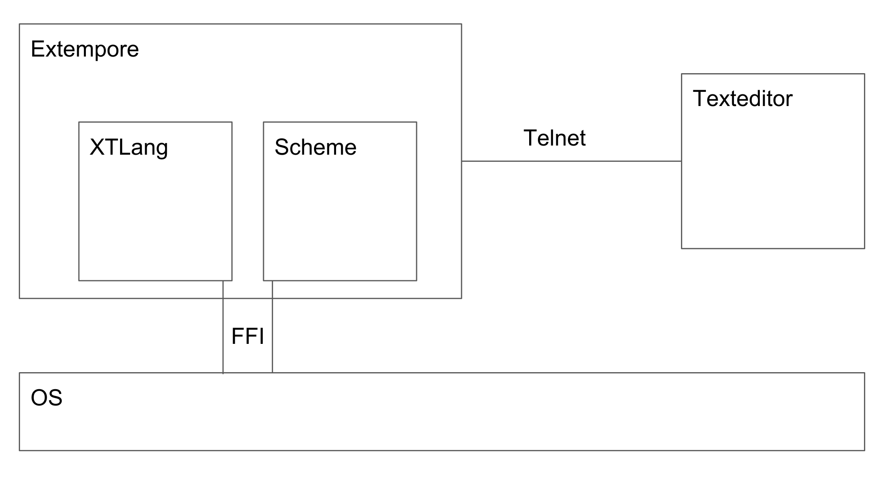

# Live Programming Seminar
- Your Name: Florian Wagner
- Your Topic: Extempore

## About the System itself
Extempore is a plattform for live programming, especially music. It supports two languages, both LISP Dialects, which can be used for the actual programs. During runtime, code can be submitted to the system and is evaluated in the context of the current state of the system, that was created by previous instructions. Extempore can be used for many applications ranging from live performances to explorative high performance computing. Among those applications, live performances of music are its heritage as well as its major application area. Therefore this report focuses on this area for the analysis of liveness in Extempore.

### System boundaries



Extempore is build around a server/client architecture, where the clients submit code via TCP to the server, running Extempore. The clients can be anything that supports TCP, even telnet, as the server reads a raw TCP-Stream and evaluates it. To evaluate the code, the server implements two different dialects of LISP, which operate in a semi-shared environment. While functions of the other environment can be called, state is confined to one environment. One of these is an implementation of R5RS Scheme and the other is a custom dialect called "xtlang" which has explicit memory management to avoid the overhead of garbage collection. Extempore can interact with the world through a Foreign Function Interface.
Apart from the server application itself, a usual installation of Extempore also packages libraries written in xtlang, which can be loaded to create certain capabilities. For example, there are libraries dealing with synthesizing of music or rendering of graphics.
Since Extempore has a focus on musical programming, the core application also includes an interface to the soundcard, which enables samples to be written from user-code. In this way, the user can create sound. Extempore offers libraries for this purpose, which come with the usual installation.
Extempore does not supply any built-in code editing, the user has to provide his own method of submitting code to the server. Extempore also does not package most C-Libraries it interacts with through FFI, those also have to be provided by the user, if he wishes to peruse them.
This report looks describes only the Extempore runtime environment and not the libraries included in a standard distribution of Extempore.

### Context
Extempore is mainly used for live performances, especially of music (Algoraves) and Graphics. In a typical algorave one or more artists are on stage with their computers, using them to generate music and graphics for the audience. Their screens are output behind them using beamers or big screens, so that the crowd can follow their actions on a superficial level. An example for such a performance is shown in @Mume .

### General Application Domain
Code development in Extempore falls into one of two categories: live performances and preperation of libraries.
The code written during performances is short lived and rarely documented or saved in and of itself, as it is seen as a means to an end. Depending on the artist there may be some rehersal this code prior to the performance, but code at a typical performance is written during that performance, relying on libraries and abstractions instead of simple replay of a previous performance.
Those libraries are written beforehand to enable an artist to express herself in a more fluent manner by provididing abstractions over basic functions. These abstractions can be anything from a virtual instrument which turns simple function calls into complex sounds to a binding of an external library such as OpenGL. This code is also developed using Extempore. However, it is usually developed offline in an iterated fashion and errors are corrected instead of incorporated. The code is of course saved, so that it can be used for future performances, libraries or shared with other Extempore developers.

### Design Goals of the System
The main design goal, as stated by @Philosophy, behind the system is to combine the flexibility of a live environment with the performance of a compiled language. This stems from a desire to have a high level of control even in processes which (soft) real-time guarantees and are therefore performance sensitive.

### Type of System
Extempore is an execution environment. This runtime Environment is provided by a single binary, which accepts code from external sources and executes it. The code can interact with systems outside of the Extempore runtime Environment through a foreign function interface. Extempore also implements a way to directly write samples to a sound interface, so that code can produce sound without using the FFI.
Extempore also packages standard library of functions which provide abstractions over commonly used functionalities, so that users do not have to write their own abstractions.

## Workflows
It is usual to change running iterations/recursions to produce different effects. Often this is done with some timing to it, so as to create "sections" in a performance.
The history of entered commands is often visible to the developer in his text editor/ workspace. However there is no explicit representation of the state of the execution environment. It is therefore difficult to build or control complex systems without deeper understanding of their inner workings.

### Example Workflow
Description of the major workflow which illustrates all relevant "live programming" features. The workflow description should cover all major elements and interactions available. Augmented by annotated pictures and screencast.

A typical example is adding an instrument which repeatedly plays a note to the environment.

1. We start the Extempore server
```
$ Extempore
```

2. We open a text editor and establish a connection with the server as described by @connecting . All further code is submitted as a selection to the environment.

3. We load some common libraries that simplify interfacing with the sound system
```
(sys:load "libs/core/instruments.xtm")
```

4. We create the instrument and add it to the Sound Output of Extempore.
```
;; create an instrument
(make-instrument s1 synth)
;; create the sound output function that is will be polled by Extempore
(bind-func dsp:DSP
  (lambda (in time chan dat)
    (cond ((< chan 2)
        (+ (s1 in time chan dat)
        (s1 in time chan dat)))
        (else 0.0))))
;; tell Extempore which function to poll
(dsp:set! dsp)
```
The DSP function is called for every sample. The sampling rate is usually around 44khz. Since a delayed sample would be noticed by the user, the DSP function is critical. It is therefore implemented in the compiled xtlang, as can be seen by the `bind-func` call used to bind it, opposed to a `define` call for scheme functions.

5. Now we can play a note on this instrument
```
(play-note (now) s1 60 80 10000)
```
6. It would be better if the computer could automatically play a melody for us, so we define a function for that. Since this is not performance critical, it can be done in scheme rather than xtlang.
```
(define melody
    (lambda (pitches)
        (play-note (now) s1 (car pitches) 80 10000)
        (if (not (null? (cdr pitches)))
            (callback (+ (now) 10000) 'melody (cdr pitches)))))
```
The melody function is very typical of Extempore, as it contains a *temporal recursion*. Extempore allows the user to schedule function calls into the future. By using this technique we built a function that will play the first nots from a provided list and schedule itself with the remaining list to be called again when the note ends.
The melody function is not time critical, it merely starts the playback of the notes, the actual sound rendering is done in xtlang. The melody function can therefore be implemented in scheme.

7. All that remains now is to call the function to kick off the melody playback
```
(melody '(60 70 80 70 60))
```

### Which activities are made live by which mechanisms?
Extempore itself offers only one interaction to the user: submitting code. This activity however is fully live. This means that code commited to the system is immediately interpreted and run in the context of the correlating envrionment. The Feedback depends on the code in question.

In a life performance there are typically two groups of people who notice the Feedback from the changes. The first group are the the developers (there is often only one developer) who notices all feedback related to the technical compilation and execution from the code. The second group is the audience, who notice feedback on different channels, mostly sound and music. The feedback the audience recieves are the artifacts the developer wants to produce and often the developer also notices those effects so as to fine tune then and make use of the live nature of Extempore.

Feedback can occur over many channels (textual ouput, music, sounds, robotic actions, graphics), but there are some standard ways: The extempore console of the running process shows when clients connect/drop out, code is commited, compiled or run as well as the results of the evaluated code. The result of the evaluated code is also send back over the connection to the client so as to notify him of success or failure of his commited code. Since functions can call out to external code (mostly C-Libraries), there can be additional feedback effects. Since extempore is mostly used for live performances involving sound and graphics most feedback for the audience (and the programmer as well) is often acoustic and visual. Depending on the IDE of the Developer, there may be additional feedback based on the returned values from the code execution.

There are three categories in which changes can fall. Those categories are fluid and depend on the state of the environment at the time of execution.
* If the code changes state or functions used in a running temporal recursion, then those changes will be noticeable by the audience as soon as the concerning state or function is evaluated again. The extent and kind of feedback to the audience depends on the involved recursions and symbols. Some changes may be small, such as changing the pitch of a note, while other changes can be big, such as changing the complete instrumentation of a piece or starving the audio buffer due to heavy processing, which results in white noise.
* If the code simply introduces new state into the system, then the change will not be visible to the audience but the developer will be notified via the evaluation result as well as the Extempore console (if he has access to it).
* If the code calls a function, possibly starting a new temporal recursion, then the results will be noticeable by the audience

The emergence phase is shortened by the use of compiled for xtlang. This enables functions written in xtlang to be fast enough to be polled for audio (44khz). This can have a drawback: bigger changes to the environment and code can lengthen the adaption time considerably if the compilation of the code in question is complicated. However this problem does not usually occur since most changes to the code are small so that adaption times are usually short as can be seen in the benchmark.

Extempore is capable of very fine granular change, since every definition in the environment can be changed on its own. At the same time an arbitrary number of definitions can be changed at once, possibly even changing the environment to something completely different.

### Integration of live activities into overall system
The System has little interaction surface, only a way to input code and some ways to recieve feedback. These are all "live" in the sense, that they are either necessary (input of commands) or show the current state (evaluation results).

The non-live parts of the system are hidden and basically contained to the framework facilitating the live environment. This environment can not be changed and as such it is not possible to change the language within itself. It is also not possible to change code that is not written in xtlang or scheme, so that most mechanisms to provide feedback (sound, graphics), have a clearly defined API that cannot be changed. The API can however be wrapped in xtlang code and this wrapper can expose new interactions by composing them out of the vocabulary of the external API.

### Limitations
While Extempore can behave in an unwanted fashion if it is overloaded and can not meet the soft-real-time criteria, it is still responsive, as the interaction and control of the system is done in a different thread from the execution environment itself. Because of this, the system remains responsive and live even if it is under heavy calculation load. The only exception to this rule would be an endless non-temporal recursion, which would block the execution environment. While new changes could be made, they would not be visible since the main execution thread would be busy with the endless recursion. This problem is mitigated by the fact that all evaluations have a maximum time. So while the unresponsive state may persist for a while it will eventually be resolved by the system. It is also unusual not to use temporal recursion for longer computations, so that the problem does usually not occur.

Extempore has very little limitations in regard to its languages, since they are both derived from LISP and are therefor highly flexible and capable of building all the desired abstractions. There are however only some basic abstractions provided out of the box, so that further affordances for working with liveness have to be built by the user.

### What happens when the live parts of the system fail/break?
When an evaluation causes an exception, the evaluation is stopped and a stacktrace is printed on the system console. Because only the evaluation causing the exception is stopped, other (scheduled) evaluations remain untouched. This means that most of the user application is still running, since there are normally multiple temporal recursions with contained state.

A failure in the tool itself, e.g. due to corrupted memory from FFI, will cause the whole environment to crash. This is due to the low-level nature of the execution environment.

### Left out features
This document mainly describes the Extempore execution environment. It does not describe the foreign function interface, because it contributes nothing to the liveness of the system.
The standard library is left out as well, since it is not required to work with Extempore and mainly builds upon the basic liveness mechanisms.


---

## Models

### Mutable or immutable past
Extempore has no special concept of past evaluations or any other model of the past. The only way in which the past manifests is the current state of the environment. Because of this, it is cearly an *immutable past* system as proposed by @Rein2016HLL.

### Tanimoto's Level of Live Programming
Extempore classifies as a *Tanimoto level 4* live system, since it "permits a programmer to edit a program while it is running, and furthermore the system continues the execution immediately and without noticeable interruption according to the updated version of the program." @Tanimoto2013PEL This is achieved through very short adaptation and emergence times as well as the seperation of adaptation and execution into different threads.

### Steady Frame
Extempore provides a constantly meaninful environment through the use of atomic updates. This is to be considered steady as described by @Hancock2003RTP page 58. However the system itself holds no explicit or readable representation of the state upon which decisions can be made. While this state is often contained in the text editor of the user, this is not a part of the system itself but more of the workflow associated with it.
Extempore is therefore *steady* but not *steady frame* as there is no explicit and intuitively understandable context in which a user could develop and understand changes.

### Impact on distances
@Ungar1997DEI proposes three distances/immediacies for live systems. While extempore has two short distances, it does not encompass a visual system. Therefore the third distance is inapplicable:
* Extempore has a very small *temporal distance* due to small adaptation and emergence times. This is further helped by the usual workflow, which is mostly comprised of small, contained changes.
* Extempore also has a very small *semantic distance*. The user has to only issue one action to change the state of the system.
* Extempore has no visual component, therefore the term of *visual distance* loses it's meaning in regard to the system itself. There is however a rough representation of the current system state in the text-editor of the user. This representation has the same visual distance as most conventional, non-live systems.


---

## Implementing Liveness

### Extent of liveness in technical artifacts
Extempore is an execution environment. The liveness therefore extends to all code running within it. The liveness stops at the threshold of the execution environment itself: the state of the environment may be changed but the rules governing the execution of the code itself are not live and can only be change through a conventional edit-compile-run cycle.
Furthermore, the responsiveness of the system may degrade if the host machine is so overloaded, that it is incapable of servicing the changes requested by the user. This is averted in most cases due to the core-loop of the system being highly optimized and the seperation of the adaptation from the exectution into different threads.

### Mechanisms of Liveness
Extempore implements several mechanisms to facilitate liveness. The first and most common one is the the REPL nature of it's languages. This is achieved by an interpreter for the Scheme language and hotswapping for xtlang.
Extempore further introduces the concept of *temporal recursion*, that is, function calls scheduled into the future and with a maximum run-time. This brings many advantages as discussed in @tempRecursion. It can be used to have multiple threads of execution inside a single environment, like coroutines. It can also be used to explicitly time the occurence of an event within the program, such as the playing of a note.
Extempore further seperates the adaptation from the execution, ensuring that the system responds in a continuous fashion to changes.

### With Time Programming
Usually programmers reason only about temporal relations within the code (x happens before y). Extempore provides a framework to reason about the temporal relations of code in regard to the real world. This means that concepts like the timing and duration of notes can be directly modelled within the language. But through the use of temporal recursion, further abstractions e.g. rythm arise organically. This concept is called *With Time Programming* and described in @sorensen2010programming.

---

## Benchmark
The typical unit of change in Extempore is a symbol/definition. There is usually only one operation executed on this unit: a (re)definition. To measure the performance for this action, a benchmark was created on a virtual machine. This benchmark takes definitions from the extempore standard library and measures the adaptation and emergence phases for them. These benchmarks are for xtlang and define the adaptation phase to end, when the compilation process is finished. The results, when run on an i7 CPU 920 @ 2.67GHz are displayed below.

*P. Rein and S. Lehmann and Toni & R. Hirschfeld How Live Are Live Programming Systems?: Benchmarking the Response Times of Live Programming Environments Proceedings of the Programming Experience Workshop (PX/16) 2016, ACM, 2016, 1-8*

---

## Personal observations
Everything that is particular about the environment and does not fit into the pre-defined categories mentioned so far.

## Style Template
- Denote headings with #
- You can use any text highlighting, list types, and tables
- Insert images in the following way:
  ``
- Insert videos or web resources as markdown links
- Insert references as: `@RefKey` and supply a bib file
- No HTML tags please
