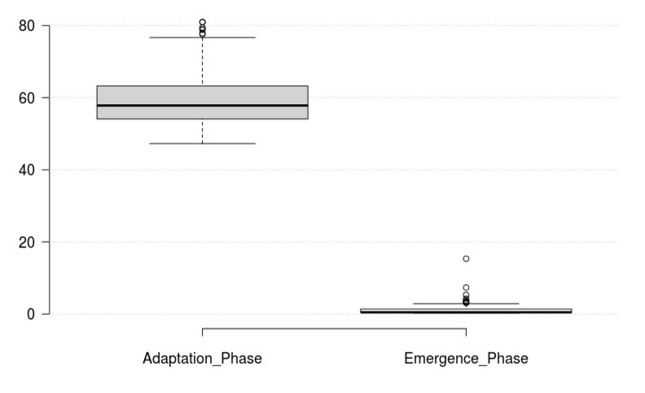

# Live Programming Seminar
- Your Name:  Tim Naumann
- Your Topic: JShell

> Generally try to drill down on reasons behind properties of the system. Make use of the general observations about the system in arguing about specific properties or mechanisms.

## About the System itself
> Summary of system properties

The system, that I want to evaluate in the following is the official Java REPL (Read-Eval-Print Loop) which will be released with Java 9 in June 2017. Therefore I experimented with the early access version. 

### System boundaries
> What have you looked at exactly? Mention the boundaries of the system and state what is included and excluded. For example, in Chrome the system might be the developer tools. This ignores any JavaScript libraries which might add additional live capabilities to the tools or to the page currently developed. Another example are auto-testing setups which span a particular editor, testing framework, and auto-testing tool.

This report is based on the JShell version 0.710 released in november 2016. No libraries or extension were added to it. However, JShell needs the Java 9 early access JDK in order to operate. Despite the fact, that new features and APIs are added to the Java programming language though Java 9, I will only focus on the REPL features provided by JShell. Furthermore it needs to be mentioned, that Java 9 is still in development. Concerning the JShell, it is therefore possible that more features could be available until the release. Nevertheless I focused on the current accessible version and evaluated following mechanisms:

 - the REPL itself with its specific commands and features
 - Hot Swapping in combination with JShell
 
### Context
> - In which context is the system used?
    For example: Application development (coding, debugging, exploration), education, art, science (data exploration), simulation, exploration of ideas or data.
- Description of user context (professional, amateur, public presentation in front of audience, (un)known requirements, children, ...)

The main context for a REPL in Java like the JShell is the desire to provide easy and comfortable access to the Java language, though addresses programming beginners or those you want to explore this language. Robert Field, the architect of JShell, points out, that "the number one reason schools cite for moving away from Java as a teaching language is that other languages have a REPL and have far lower bars to an initial "Hello, world!" program" [1]. Therefore JShell tries to fill this lack of immediate feedback based on a REPL in order to lower the learning curve for initial learning.  Furthermore the REPL can be used in order to investigate new API or to prototype quickly.

### General Application Domain
>  - What is typically created in or through this system?
>  - What are users trying to accomplish with it?
>  - What kind of systems are modified or developed with it (graphical application, client-server architecture, big data, streaming)?
  
The JShell is not designed to create complex software architectures like client-server applications. It is rather used to create, change and to test algorithms or to check languages specification like syntax and semantics of Java. As a result, the general application domain is limited to little programs based on few classes or small GUIs for test purposes. 

### Design Goals of the System
> What is the design rational behind the system? Which values are supported by the system? Which parts of the system reflect this rational? For example, auto-testing setups are designed to improve productivity by improving the workflow for TDD through providing feedback on the overall system behavior during programming. Smalltalk systems are designed for expressiveness and enabling understanding through allowing users to directly access and manipulate all runtime objects in the system.

The system heavily supports prototyping and the exploration of Java code and APIs. Here for example, JShell provides features like auto-completion for types and methods, a little editor for classes as well as extra commands like /imports, /types and /methods, supporting the developer to quickly implement prototypes and to maintain an overall view about the code and new APIs. Furthermore it is possible for the developer to change classes and methods on demand while the program is running. The developer is therefore able to change system behavior interactively, but only to a limited extent. More information about this limits can be found within section [Limitations](#limitations).

### Type of System

> What is the general nature of the system? For example: interactive tool, system, library, language, execution environment, application. What makes the system part of that category?

The JShell represents an interactive tool, giving immediate feedback based on developers input. A context for code is provided so that users are able to execute their code without for example a main-function. Therefore JShell can be also be seen as an execution environment for Java. 

---

## Workflows
Summary of workflow observations

### Example Workflow
> Description of the major workflow which illustrates all relevant "live programming" features. The workflow description should cover all major elements and interactions available. Augmented by annotated pictures and screencast.

Within this workflow, a modified "pong-game" will be created, where the user, controlling a racquet, is not allowed to let the ball reaching the bottom of the screen. The GUI is based on the Java swing API. I used Java awt to have a handy implementation for points, graphics and dimensions as well.


####The REPL, Immediate Command and Statement Evaluation
1. Open the JShell 
2. Create the class "Ball" ([Source can be found here](#ballclass))
	3. After you have entered the class, JShell gives you an acknowledgment whether your implementation is valid or not . A "created class Ball" notation should be shown in the terminal.
	4. If we now type "/types" in the JShell command prompt, "class Ball" exists.
4. To be able to show the ball in a GUI, a class called GamePanel is added ([Source can be found here](#gamepanel1)) which specifies a JPanel with a Ball instance in it.  
5. If we want to launch our application, normally we would have to create a main-function in a specific class as entry-point for the program.  JShell already provides a context, that wraps all expressions and statements within a synthetic method within a synthetic class. Structures like classes and methods are static members of a synthetic class. As a result we do not need a static main method. Expressions and statements are evaluated and executed as soon as we entered them. With the following commands, we can show our GUI with the Bouncing Ball in it:

```java
JFrame frame = new JFrame("Modified Pong");
frame.setDefaultCloseOperation(JFrame.EXIT_ON_CLOSE);
//Create and set up the content pane.
GamePanel newContentPane = new GamePanel();
newContentPane.setOpaque(true); 
//content panes must be opaque
frame.add(newContentPane);

//Display the window.
frame.pack();
frame.setLocationRelativeTo(null);
frame.setVisible(true);
		
while(true) {
	newContentPane.play();						
	try {
		Thread.sleep(20);
	} catch (InterruptedException e) {
		e.printStackTrace();
	}
}
```

#### Code-Modifications at Run-Time

 While the program is running, we are able to alter its behavior to a certain extent. Just like the JVM, JShell is able to provide Hot-Swapping. Here for example, we can change the color of the Ball while the application is running.
	 
- We first have to enter the ` /edit Ball` command into the JShell. A small editor appears, where we can see our class definition for "Ball".  We now change the method-body of getColor() to 
	` return Color.BLUE;`
and accept the changes. As a result, a notification is shown which indicates, that the "Ball" class was modified. The ball in the application changes it's color to blue.

- We also can access the color of the ball, while the program is running via the newContentPane instance. Here we can get the color RGB value by typing:
 ` newContentPane.getBall().getColor().toString()`
 The result should be "[r=0,g=0,b=255]". JShell also provides an auto-completion functionality using the Tab-key. All accessible methods (the members which are declared as "public") and variables are shown if you use it. If you access private members, JShell will throw an error.

Now we want to extend our program. For our game, we need a racquet which can actively collide with the ball and steers it as a result in another direction.  

3. First we extend our GamePanel class. Here we create a racquet instance of our Racquet class. 
		- Type ``` /edit GamePanel``` into the JShell. The editor should appear. Now declare the private attribute racquet ``` private Racquet racquet;``` and click on accept and on exit.
		- We now get a notification that GamePanel is replaced, and that it *cannot be referenced until Racquet is declared*. So instead of a compile error, JShell uses forward reference to handle this undeclared member. As code is entered and evaluated sequentially, these references will be temporarily unresolved [1]. As a result, we are not able to instantiate GamePanel anymore without having the Racquet class declared.  
	- Furthermore, JShell resets instances like the newContentPane object to null. We do not get a notation for it, but if you for example enter the object name *newContentPane* into the JShell, it shows that the instance is set to null. Despite this fact, we still see the GUI with the ball moving inside and could also reference the ball inside the thread itself. JShell resets the objects within the user session that depends on the updated classes or structures but every thread in the underlying JVM itself has a working memory in which it keeps its own working copy of variables that it has to use or assign [3]. As the thread executes a program, it operates on these working copies. Within our example its the GamePanel object *newContentPane*. As a result, we do not get a NullPointerException out of the existing GUI thread and have to close the GUI on our own. Close it now. 
	2. We now create the Racquet class [(Source can be found here)](#racquet). Our racquet here is a rectangle, that listens to user interactions with the keyboard. In the end we should able to move it using the left and right arrows on our keyboard. Enter the Racquet class into the JShell. 
	3. To recognize the collisions between the racquet and the ball, we use a simple approach. The "Rectangle" java library offers a method named intersects, that checks whether or not two rectangles overlap based on their dimensions and positions. That is a simple solution but it is sufficient for our use-case. 
		- To use this approach we have to model our ball as rectangle (as square in particular). The rectangle edges are just as long as the ball radius. We extend our "Ball" class with a method getBounds(), that returns our ball as rectangle. To do so type "\edit Ball" into the JShell and extend the Ball class with following method:

- >  public Rectangle getBounds() { 	
>      return new Rectangle(location.x,location.y, getRadius(), 
	getRadius());  } 

- We also have to edit our GamePanel class in order to recognize the collisions and to react properly. As already mentioned, we use the intersects-method of the "Rectangle" library in order to detect collisions. Replace the current GamePanel class with the one defined [here](#gamepanel2).  To do so, again type "/edit GamePanel" in the JShell and replace the code. Within this code, a gameOver() method is also added to the GamePanel class that pops a "Game Over Message" if the player does not manage to prevent the ball from touching the ground of the game panel. We now have to execute the code [here](#execution) again to start our GUI. 
	- 
	
4. Now we want to control our racquet based on keyboard input. To do so, we first have to import following libraries
>  import java.awt.event.KeyListener;
>    import java.awt.event.KeyEvent; 

	- To import these libraries, just insert the statements into the command line. Within the JShell, we have the potential to import the whole Java API provided by JDK 9. This is intended by the JShell developers to support the users in exploring Java and its API  to have a rapid learning curve.
5.  Now we are able to add keylisteners to our GamePanel constructor. Add following code to the constructor after defining the racquet and the ball object. Again use the "/edit GamePanel" command.
```java
 addKeyListener(new KeyListener() {
			@Override
			public void keyTyped(KeyEvent e) {
			}

			@Override
			public void keyReleased(KeyEvent e) {
				racquet.keyReleased(e);
			}

			@Override
			public void keyPressed(KeyEvent e) {
				racquet.keyPressed(e);
			}
		});
		setFocusable(true);
```
- After you have successfully updated the class, you will again get a message, that the GamePanel class was replaced and that instances like newContentPane were reset. Usually Hot Swapping would allow to update class constructors during run-time without causing JShell to replace the whole class. Nevertheless the code above alters the signature of the class by adding KeyListeners to it. As a result, JShell has to replace all GamePanel instances. We now have to close the old GUI and have to execute the code [here](#execution) again to propagate our changes. 
-  Finally we are able to controll our Racquet and to play the game. 


	
	
### Which activities are made live by which mechanisms?
 > Description of each concrete activity in the workflow and the underlying liveness mechanism (which is described on a conceptual level and thus could be mapped to other systems) 
 
 >  - Actual interactions and Feedback mechanisms

There are two mayor liveness mechanisms within the workflow:

1. The evaluation of statements and commands (for example the adding of classes) results in immediate feedback from the JShell.  
-  The Read-Eval-Print Loop iterates over the user input and interprets it "as soon as" statements/commands are entered. The evaluation thread gives feedback based on messages or exceptions that are printed onto the command line. 
		
2.  Direct manipulations of the runtime state (source code replacement) by changing the ```getColor()``` method of the "Ball" class. ????
 - Hot Swapping allows JShell to update methods at run-time by replacing their Java byte-code.  It allows for incremental and therefore quick changes to the executable form and preserves the current context of a change (@Rein2016HLL). As a result, we are able to manipulate the runtime state of an application by a redefinition of method bodies. If a method was updated successfully or if errors occur using Hot Swapping, JShell again prints out messages and appropriate exceptions.
 
> - If applicable: How is the emergence phase shortened?

In general, the emergence phase for the evaluation of simple statements as well as for the Hot Swapping mechanism is very short based on heavily optimized Just-In-Time compilers in the JVM. Nevertheless, Due to the fact, that the JVM needs to replace  
Nevertheless compiling and evaluating complex programs is non-immediate whereas the  Hot Swapping always 
// add benchmarking here

> - Granularity: For example: Elm can only rerun the complete application

JShell is able to perform changes on all levels of granularity. On the one hand, fine-grained manipulations of application state can be realized using Hot-Swapping while on the other hand it is also able to open complex programs or to rerun them using specific commands. 

### Integration of live activities into overall system
> Which activities in the system are not interactive anymore? Which elements can be manipulated in a live fashion and which can not?
> How does this workflow integrate with other parts of the system (potentially not live)? What happens at the boundaries between live parts and non-live parts? For example, the interactively assembled GUI is later passed to a compiler which creates an executable form of the GUI.

When used correctly, there are no parts of JShell that are not live. However, the live activities highly depend on the code entered by the user or the executed programs. Within my workflow, I intentionally used threads for the described game in order to show all possible live mechanisms of JShell. I was able to alter the program behavior using for example Hot-Swapping because I created several parallel execution contexts based on these threads as well as implemented my application in a way, that causes behavior updates if specific method bodies are changed on runtime. However, if the JShell main-thread  is blocked unintentionally by a program (due to for example endless loops like the one used in the execution code of the game), the developer is unable to enter any statements into the JShell due to the blocked evaluation thread. As a result, the liveness mechanisms based on statements, commands and Hot Swapping cannot be used anymore . 

###  Limitations  <a name="limitations"></a> 
> To which extend can the liveness of one activity be kept up? For example, at which magnitude of data flow nodes does the propagation of values become non-immediate? At which magnitude of elapsed time can the Elm debugger not replay the application immediately anymore or when does it break down? Does an exception break the liveness?

The JShell-REPL itself evaluates single statements, expressions and commands immediately without any loss of output emergency. Nevertheless, if you open complex statement files of java code, the JShell needs time to enter and evaluate each of the statements individually. The propagation of values become non-immediate. #


	
>Further, what are conceptual limitations. For example, in a bi-directional mapping system properties of single elements might be modified and reflected in the code. This might not be possible for properties of elements created in loops.

#### Hot Swapping Limitations
Per default, the capabilities of redefinition using Hot-Swapping are limited to method bodies. It cannot either add methods or fields or otherwise change anything else, except for the method bodies. This limitation is based on requirements for performance and stability of the underlying JVM. Two heavily optimized Just-In-Time compilers as well as several multi-generational garbage collectors challenges the implementation of an extended Hot Swapping feature. Due to the occupation of a specific size and structure of memory for each object in the system, a change of a class signature would trigger a need of memory rearrangement and relocation within the whole system and especially for all instances of this specific class. 
The first problem here is that the actual layout of memory depends on the garbage collector that is currently active and, to be compatible with all of them, the relocation should probably be delegated to the active garbage collector. Therefore we would have to suspend the JVM in order to perform memory relocations.  Furthermore multiple platforms with varying memory models and instructions sets could also need special treatments that increase further implementation efforts and decreases platform independence.
The second problem accompanies with the high optimized JIT compiler. The main optimization that the JVM does is inlining. Here most of the method calls are replaced by there implementation in order to spare the actual call and as a result improve performance. As a result, adding a method to a class would arise the need to check all tracked inlined spots and their dependencies in order to deoptimize them. This would be a severe performance hit for the JVM (@Booth2010).
As a result, Hot Swapping is limited to method bodies in order to optimize the overall system performance as well as to maintain platform independence of the JVM.  However, tools like JRebel tackle and solve the problems concerning Hot Swapping but are not part of the default JVM implementation and therefore not in the scope of this report. 

### What happens when the live parts of the system fail/break?
> What happens when the application under development causes an exception? How does the system handle these exceptions (provide debugger, stop execution, stop rendering, ...)? Does the liveness extend to these exceptions?
How can the system itself break? What happens when there is a failure in the system/tool itself?

In case of an error or rising exceptions due to the input of invalid java code into the JShell command line, it propagates this error onto the command-line itself. Here the thread for input-evaluation catches the error, prints an appropriate message or a specific exception and **continues evaluation** of the remaining commands and statements. If this thread is terminated through user code, it is restarted again immediately by the JVM. In this process it looses its former state and all inputs made by the user are gone but can be restored through specific commands that re-execute statements that were saved within the JShell internal "Replay History". (see section [Left out Features](#features) for more informations)

In case of an error within the process of editing classes or methods via the editor provided by the "/edit some_class" command (for example some invalid Java-Code is entered into the editor), no update is applied to the method or class in change and a specific exception is thrown. Furthermore no hot swapping is done if the users intention was to change methods at run-time . The exception handling here is the same as in case before. 

### Left out features  <a name="features"></a> 

> Which features of the system were not described and why were they left out?

JShell provides several commands that can be used to investigate declared types and object instances, to open files or save inserted input etc. Some of these commands were already used within the workflow but there are several more.

An interesting one is the Replay History that enables ...

Tab-completion implemented using the javac Compiler API

 (Type \help in the JShell to get an overview). 
They were left out due to the fact that they do not make contribution to the liveness aspect of the overall system.

---

## Models

### Mutable or immutable past
> To which category does the system or parts of it belong and why?

The live mechanisms wihthin the JShell belong to the immutable past model. The code evaluation as well as hot-swapping preserves the current context of a change. As
a result, the application can continue the execution from the state at which the change was applied with changed behavior.

*P. Rein and S. Lehmann and Toni & R. Hirschfeld How Live Are Live Programming Systems?: Benchmarking the Response Times of Live Programming Environments Proceedings of the Programming Experience Workshop (PX/16) 2016, ACM, 2016, 1-8*

### Tanimoto's Level of Live Programming
> To which level of liveness do single activities belong, based on the definitions of the 2013 paper and why?

The liveness mechanisms used in the JShell cannot be assigned to exactly one level described by Tanimoto.  The fact that the code evaluation is explicitly triggered by the user using the enter key on its keyboard or the accept button in the JShell editor indicates an edit-driven update for  the JShell state. Therefore the definition of Tanimotos level 3 fits to the code evaluation. Nevertheless, the JShell remains constantly running during modifications. This fact satisfies level 4 characteristics specified by Tanimoto. Therefore it is difficult using the given definitions to assign a fix level to the liveness mechanisms of the JShell.  

*S. L. Tanimoto A perspective on the evolution of live programming Proceedings of the 1st International Workshop on Live Programming, LIVE 2013, 2013, 31-34*

### Steady Frame
> Which activities are designed as steady frames based on the formal definition and how?

The JShell itself does not provide a steady frame.  The fact that we are able to inspect its state with commands like "/vars" or "/types" and have to enter these commands explicitly does not for example satisfy the need to have a certain "frame", that shows relevant variables at specific locations within the scene. Furthermore, the propagated values based on these commands are  not "constantly meaningful": The information provided for object instances are for example limited to memory addresses and therefore insignificant for the user. Nevertheless, developers are able to implement a steady frame for the application on their own. 

*C. M. Hancock Real-Time Programming and the Big Ideas of Computational Literacy Massachusetts Institute of Technology, Massachusetts Institute of Technology, 2003*

### Impact on distances
> How do the activities affect the different distances: temporal, spatial, semantic?

 Following distances evolves in the context of the JShell.
 
 1. Small Temporal Distance:
 As already mentioned, the evaluation of single statements and expressions as well as the replacement of code during run-time are activities that are perceived as live by users. These mechanisms causes immediate feed due to their short execution times therefore providing a small temporal distance.
 
 2. Any Spatial Distance:
 The spatial distance depends on how developers using the JShell for their needs. If users for example interact with the JShell based on the provided command line, a small spatial distance arise. However, if IDEs or editors are used in order to develop applications that are afterwards executed using the JShell, the spatial distance is arbitrary and therefore individually for each user.  
 
 3. Small Semantic Distance:
 The Jshell represents an execution environment for applications written in Java. Therefore users intentionally interact with the JShell in order to write code for their applications or to execute it. As a result, their fully aware of the behavior and the results arising from the entered code.  The semantic distance is therefore small.


*D. Ungar and H. Lieberman & C. Fry Debugging and the Experience of Immediacy Communications of the ACM, ACM, 1997, 40, 38-43*

---

## Implementing Liveness

(Die evaluierung von Statements bisschen in die Tiefe erklären, es ist interessant dass accept dasselbe macht wie eval of statements)


jede expression wird declared allEvents.addAll(declare(snip, snip.syntheticDiags()));
### Extend of liveness in technical artifacts
> What parts of the system implements the liveness? (Execution environment, library, tool...)

As already mentioned, we have two liveness mechanisms: the immediate evaluation of statements, expressions and commands as well as the opportunity to replace code at run-time. Here, the implementation of both mechanisms makes every effort to leverage the accuracy and engineering effort of the existing language support in the JDK: 

1. The immediate evaluation is implemented by the execution environment itself that re-executes the evaluation of user input in a loop using the JDK Compiler API.  
2. The replacement of code is realized by the underlying JVM using Hot Swapping. 

### Implementations of single activities
> Description of the implementation of live activities. Each implementation pattern should be described through its concrete incarnation in the system (including detailed and specific code or code references) and as an abstract concept.

#### Code and Input Evaluation

The input evaluation is done by JShell, using an endless loop, that re-executes the evaluation process of user input. The endless loop implementing this process is part of the JShellTool class and is called right after the start of the tool:

```java
// the boolean "live" is set to true after the successful 
// initialization of the JShell instance
while (live) {
	//Input is read in here line by line
	[...]
	
	// Trim whitespace off end of string
	String trimmed = trimEnd(raw);
	        
	if (!trimmed.isEmpty()) {
		String line = incomplete + trimmed;
		// No commands in the middle of unprocessed source
	    if (incomplete.isEmpty() && line.startsWith("/") && !line.startsWith("//") && !line.startsWith("/*")) {
		processCommand(line.trim());
	} else {
		// 
		incomplete = processSourceCatchingReset(line);
	}
}
```


The loop distinguishes between commands and java statements/expressions.  If the user finishes his or her input, the distinction is made. The most important method for triggering the process of statement evaluation is called *processCompleteSource*. It is used several times within the JShellTool class and represents the entry for statement evaluation:

```java
 private boolean processCompleteSource(String source) throws IllegalStateException {
	boolean failed = false;
	boolean isActive = false;
	List<SnippetEvent> events = state.eval(source);
	for (SnippetEvent e : events) {
		// Report the event, recording failure
		failed |= handleEvent(e);
		// If any main snippet is active, this should be replayable
        // also ignore var value queries
        isActive |= e.causeSnippet() == null &&
        e.status().isActive() &&
        e.snippet().subKind() != VAR_VALUE_SUBKIND;
    }
    // If this is an active snippet and it didn't cause the backend to die,
    // add it to the replayable history
    if (isActive && live) {
	    addToReplayHistory(source);
    }
	return failed;
}
```


```java
 private List<SnippetEvent> declare(Snippet si, DiagList generatedDiagnostics) {
        Unit c = new Unit(state, si, null, generatedDiagnostics);
        Set<Unit> ins = new LinkedHashSet<>();
        ins.add(c);
        Set<Unit> outs = compileAndLoad(ins);

        if (!si.status().isDefined()
                && si.diagnostics().isEmpty()
                && si.unresolved().isEmpty()) {
            // did not succeed, but no record of it, extract from others
            si.setDiagnostics(outs.stream()
                    .flatMap(u -> u.snippet().diagnostics().stream())
                    .collect(Collectors.toCollection(DiagList::new)));
        }

        // If appropriate, execute the snippet
        String value = null;
        JShellException exception = null;
        if (si.status().isDefined()) {
            if (si.isExecutable()) {
                try {
                    value = state.executionControl().invoke(si.classFullName(), DOIT_METHOD_NAME);
                    value = si.subKind().hasValue()
                            ? expunge(value)
                            : "";
                } catch (ResolutionException ex) {
                    DeclarationSnippet sn = (DeclarationSnippet) state.maps.getSnippetDeadOrAlive(ex.id());
                    exception = new UnresolvedReferenceException(sn, translateExceptionStack(ex));
                } catch (UserException ex) {
                    exception = new EvalException(translateExceptionMessage(ex),
                            ex.causeExceptionClass(),
                            translateExceptionStack(ex));
                } catch (RunException ex) {
                    // StopException - no-op
                } catch (InternalException ex) {
                    state.debug(ex, "invoke");
                } catch (EngineTerminationException ex) {
                    state.closeDown();
                }
            } else if (si.subKind() == SubKind.VAR_DECLARATION_SUBKIND) {
                switch (((VarSnippet) si).typeName()) {
                    case "byte":
                    case "short":
                    case "int":
                    case "long":
                        value = "0";
                        break;
                    case "float":
                    case "double":
                        value = "0.0";
                        break;
                    case "boolean":
                        value = "false";
                        break;
                    case "char":
                        value = "''";
                        break;
                    default:
                        value = "null";
                        break;
                }
            }
        }
        return events(c, outs, value, exception);
    }
```


```java
 private Set<Unit> compileAndLoad(Set<Unit> ins) {
	        [...]
            // compile and load the legit snippets
            boolean success;
            while (true) {
              [...]
                    // generate class files for those capable
                    CompileTask ct = state.taskFactory.new CompileTask(outerWrapSet(legit));
                    if (!ct.compile()) {
                        // oy! compile failed because of recursive new unresolved
                        if (legit.stream()
                                .filter(u -> u.smashingErrorDiagnostics(ct))
                                .count() > 0) {
                            // try again, with the erroreous removed
                            continue;
                        } else {
                            state.debug(DBG_GEN, "Should never happen error-less failure - %s\n",
                                    legit);
                        }
                    }

                    // load all new classes
                    load(legit.stream()
                            .flatMap(u -> u.classesToLoad(ct.classList(u.snippet().outerWrap())))
                            .collect(toSet()));
                            [...]
                    // loop by replacing all that have been replaced
                    if (!toReplace.isEmpty()) {
                        replaced.addAll(toReplace);
                        replaced.stream().forEach(Unit::markForReplacement);
                    }

                    success = toReplace.isEmpty();
                }
                break;
    }
```


Within this method, first an attempt is being made to convert the input source into so called *snippets* using ```state.eval(source)```. A snippet can be one expression, statement, variable declaration, method declaration, class declaration or import. Within the creation process of a snippet, the input is parsed into an AST using the already existing javac compiler (and evaluated if possible by another thread using the JDI . The result is "merged" into the JShell state and propagated to the command line. After a snippet could be created successfully based on the input, the input itself is added to the JShell internal "Replay History" using ```addToReplayHistory(source)```. This implements the history and reload feature of entered code using JShell commands (described in the [Left out Features](#features) section). 

It needs to be mentioned, that each statement or expression is evaluated individually. Every single one is checked for completeness, is trimmed and converted to a token string, parsed into an AST and finally evaluated in order to create a corresponding snippet at the end. Thus, large code bases challenges the performance of the execution environment. As a result, feedback and liveness mechanisms are not immediate anymore. 

#### The Build-In Editor <a name="editor"></a> 

As already demonstrated within the workflow, JShell provides a build-in editor that provides the ability to edit for example classes or attributes. Nevertheless, this editor is not implemented within the Jshell itself, it rather comes from JDK internal libraries called ```jdk.internal.editor.spi```. The most interesting part of this editor is the "accept" button, that triggers the evaluation of the edited structure anew. If the user for example updates methods of a class, the complete class is evaluated again. 

The implementation of the accept button is pretty similar to the one used in the main loop. Again the  ``` processCompleteSource``` method is used in order to evaluate the input modified within the editor. Thus, input is always treated the same way within the JShell whether it is directly inserted into the command line or entered via the external editor. So like the evaluation within the command line, using the editor leads to performance issues in combination with large code bases. 


```java
public void accept(String s) {
	// checks if a re-evaluation is needed
	[...]
	
	while (true) {
		CompletionInfo an = analysis.analyzeCompletion(s);
		if (!an.completeness().isComplete()) {
			break;
		}
		String tsrc = trimNewlines(an.source());
		if (!failed && !currSrcs.contains(tsrc)) {
			failed = processCompleteSource(tsrc);
		}
		nextSrcs.add(tsrc);
		if (an.remaining().isEmpty()) {
			break;
		}
		s = an.remaining();
	}
	// resets JShell state in case of a fatal error
	[...]
}
```


####Code Replacement

The JShell provides the ability to replace code at run-time using the Hot-Swapping mechanism. This code replacement is done within the evaluation process of statements or expressions described above. Here the Java Debug Interface (JDI) is used,  providing explicit control over a virtual machine's execution. It offers the ability to create suspend, and resume threads, to inspect local variables and the stack backtrace as well as to load classes. As already mentioned, JShell uses this specific JDI API to replace the code. The call to the JDI API is done within the  ```redefine``` method, directly accessing the virtual machine in order to redefine the given class as byte code using the  ```vm().redefineClasses(rmp)```  call.
** an in-place replacement of the classes (preserving class identity) --
     * that is, existing references to the class do not need to be recompiled.
*

```java
   boolean doRedefines() {
        if (toRedefine.isEmpty()) {
            return true;
        }
        ClassBytecodes[] cbcs = toRedefine.stream()
                .map(ClassInfo::toClassBytecodes)
                .toArray(ClassBytecodes[]::new);
        try {
            state.executionControl().redefine(cbcs);
            state.classTracker.markLoaded(cbcs);
            return true;
        } catch (ClassInstallException ex) {
            state.classTracker.markLoaded(cbcs, ex.installed());
            return false;
        } catch (EngineTerminationException ex) {
            state.closeDown();
            return false;
        } catch (NotImplementedException ex) {
            return false;
        }
    }

```

Due to the fact, that the process of statement evaluation via editor and command line is based on the same core implementation, the redefinition of method bodies during run-time can be realized using both input sources. 
Furthermore, the use of the JDI API offers opportunities for further development to enhance the JShell itself. Possible features could be for example a Debugger or the implementation of liveness elements like a Steady Frame.


### Within or outside of the application
> For each activity: Does the activity happen from within the running application or is it made possible from something outside of the application? For example, a REPL works within a running process while the interactions with an auto test runner are based on re-running the application from the outside without any interactive access to process internal data.

The input evaluation happens right within the execution environment, whereas Hot Swapping 

## Benchmark  <a name="benchmark"></a> 

> 1. **Unit of change:** Determine relevant units of change from the user perspective. Use the most common ones.
2. **Relevant operations:** Determine relevant operations on these units of change (add, modify, delete, compound operations (for example refactorings)).
Modifying a method based on Hot Swapping, Add class
3. **Example data:** Select, describe, and provide representative code samples which reflect the complexity or length of a common unit of change of the environment. The sample should also work in combination with any emergence mechanisms of the environment, for example a replay system works well for a system with user inputs and does not match a long-running computation.
4. **Reproducible setup of system and benchmark**
  1. Description of installation on Ubuntu 16.04.1 LTS
  2. Description of instrumentation of system for measurements: The measurements should be taken as if a user was actually using a system. So the starting point of a measurement might be the keyboard event of the save keyboard shortcut or the event handler of a save button. At the same time the emergence phase ends when the rendering has finished and the result is perceivable. The run should include all activities which would be triggered when a developer saves a unit of change (for example regarding logging or persisting changes).
5. **Results for adaptation and emergence phase**

### Unit of Change

The most common units of change is a class or its methods implemented by the user. Classes and methods can be declared and evaluated using the command line or the build-in editor. 

### Relevant Operations

In the context of the JShell, classes can be "added", "modified" or "replaced".  Replacing a class during run-time resets all instances of this class and leads to a loss of parts of the application context. Therefore, we are only able to maintain the liveness-characteristic of code replacement  during run-time by adding or modifying classes. After a class is added, it is "modified" if the new updates do not change its signature (therefore these updates are limited to code-replacment of method-bodies). A change of the class signature leads to a "replacement".  
Methods can also be "added" or "modified". The modification of a method within a specific class implies a "replacement" or a "modification" of this class. 

### Example Data
According to specific example data, it needs to be mentioned, that entered classes and methods could be arbitrary due to the fact, that each user is free to implement code without any restrictions. Therefore, both units of change can vary in a wide range in terms of length or complexity based on the developers needs and programming styles. As a result, it is a difficult task to find specific code samples which reflect the complexity or length of a "common" unit of change. A possible solution for this may be found in guidelines for coding styles that specify crude measurements for code length of classes and methods as well as for their complexity.  Based on  Roock and Lippert (@Roock2006), following guidelines should be considered for implementations in regard to classes and methods:

1. Methods should not have more than an average of 30 code lines (not counting line spaces and comments).
2. A class should contain an average of less than 30 methods, resulting in up to 900 lines of code. 

Nevertheless, these guidelines are hardly applicable to implementations using the JShell due to its application domain that is based on language feature learning or fast prototyping. Within this domain, coding styles are less important. 

### Reproducible setup of system and benchmark 

####Description of installation

1. In order o be able to launch the JShell, the Oracle JDK 9 is needed. Install it using following commands:
	-  Add Oracle's PPA using: `sudo add-apt-repository ppa:webupd8team/java`
	- Update package repository: `sudo apt-get update`
	- Install the JDK 9: `sudo apt-get install oracle-java9-installer`
2. Download or clone the git-repo of the live programming lecture into an arbitrary folder.
4. Within the `live-programming-systems/projects/jshell/code`  folder, following can be found:
	- A JShell.jar that represents the JShell-tool
	- A `jdk.jshell`  folder, that contains the modified class-files which is used in order to replace the default JShell implementation of the JDK 9 on application-start
	- A `benchmark` folder that comprises all files that are needed for the benchmark

####Start the application

1. Move to the `live-programming-systems/projects/jshell/code`  folder using the terminal.
- `cd live-programming-systems/projects/jshell/code`
2. In order to start the application, we need to launch the JShell.jar with the modified class-files specified in the `jdk.jshell`  folder.
	- Enter following command: 
	`java --patch-module jdk.jshell=./jdk.jshell -jar JShell.jar`
2.  Now the JShell should launch within the terminal. 


####Benchmark Specification

I benchmarked the time needed for code replacement of a method body.  The data for this benchmark is based on my work-flow. Here, I replaced the "getColor" method of the "Ball" class in order to change the ball color. The method were updated from:  

```java
public Color getColor() {
	return Color.RED;
}
```

to:

```java
public Color getColor() {
	return Color.BLUE;
}
```

Overall, I benchmarked the time needed for a complete update-cycle of the ball color. Following steps are part of this cycle:

1.  The developer uses the build-in editor in order to change to "getColor" method-body during application run-time.
2.  The change is propagated using the "accept"-button of this editor. 
	
The overall time needed for code-replacement starts after triggering the accept button of the editor and stops after the color-change was propagated onto the application panel. 
The adaptation phase within this context is the time needed to recompile the changed "getColor"-method and to update the corresponding "Ball" class bytecode in the JVM memory. The emergence phase represents the time needed to propagate the ball color changes onto the application panel.

####Benchmark Implementation

In order to automate the benchmark of this update-cycle, I simulated the manual replacement of the "getColor" method-body by using the method triggered by the "accept"-button. As described in section [Build-In Editor](#editor) , this method reads the input string entered in the build-in editor and evaluates it. Using this characteristic, I specified two "Ball" classes that only differs in the implementation of the "getColor" method and passed them alternately as input parameter into this specific method.  As a result, I was able to measure to time needed for every update-cycle. 

The benchmark itself is implemented as additional command for the JShell. After launching the JShell, enter following command: 

- `/benchmark`

The benchmark itself needs files specified in the  `benchmark` folder. Make sure is is present next to the JShell.jar.

During benchmark, the application specified in my work-flow is executed first. After the successful launch of the game the actual benchmark starts. The time needed for each update-cycle is saved in a file called `benchmarkResults.txt` within the  `benchmark` folder

####Benchmark Results

The benchmark was performed on a system with the following specifications:

- 8 GB RAM
- Intel(R) Core i7-3612QM CPU 560 @ 2.10GHz, 4 cores 
- Ubuntu 14.04 operating system

Following chart shows the benchmark results for 100 update-cycles. 



It is clear that the adaptation phase covers most of the response time with an average of 57 ms. The emergence time is very short with 3 ms. Therefore, the system can maintain the causal relationship within this process due to an overall system response time of 60 ms. The user experiences the changes as immediately or "live". 
It needs to be mentioned, that this benchmark and therefore the benchmark results are based on a minimal example data. The method that was changed during the benchmark represents a simple, single-line class method without any complexity. There are not many methods which are more simpler than the method I changed during the process. Therefore, the resulting compile time as well as the reload time of class bytecode (the overall adaptation phase) can be considered as minimal. The same applies to the emergence phase. The application I implemented during the work-flow is based on a simple loop that have a minimum of complexity and therefore a low emergence time. As a result, the emergence time within this benchmark covers a small time period as well. 
It is clear that the emergence as well as the adaptation time highly depends on the implemented application and its use. Therefore, complex use-cases are conceivable that can lead to non-immediate feedback and thus to a loss of liveness. Nevertheless, a minimum time period of code replacement of method bodies can be specified with a value of ca. 55-60ms. 

*P. Rein and S. Lehmann and Toni & R. Hirschfeld How Live Are Live Programming Systems?: Benchmarking the Response Times of Live Programming Environments Proceedings of the Programming Experience Workshop (PX/16) 2016, ACM, 2016, 1-8*

---

## Personal observations
> Everything that is particular about the environment and does not fit into the pre-defined categories mentioned so far.

## Style Template
- Denote headings with #
- You can use any text highlighting, list types, and tables
- Insert images in the following way:
  ``
- Insert videos or web resources as markdown links
- Insert references as: `@RefKey` and supply a bib file
- No HTML tags please

## References

1. Robert Field. JEP 222: jshell: The Java Shell (Read-Eval-Print Loop)
http://openjdk.java.net/jeps/222 (2014). Accessed 31.10.2016
2. Collision detection: http://www.edu4java.com/en/game/game6.html. Accessed 22.12.2016
3. Threads & Locks: The JavaTM Virtual Machine Specification https://docs.oracle.com/javase/specs/jvms/se6/html/Threads.doc.html. Accessed 14.01.2017

#Appendix


###The Ball Class  <a name="ballclass"></a> 
```java
import java.awt.Point;
import java.awt.Color;
import java.awt.Graphics;
import java.awt.Rectangle;

public class Ball {
		private Point location;
	    private int radius;
	    private int dx = 5, dy = -5;

	    public Ball(Point l){
	    	radius = 32;
	        location = l;
	    }

	    public Point getLocation() {
	        return location;
	    }

	    public void setLocation(Point location) {
	        this.location = location;
	    }

	    public int getRadius() {
	        return radius;
	    }

	    public Color getColor() {
	        return Color.RED;
	    }

	    public void setMotion(int dx, int dy){
	        this.dx = dx;
	        this.dy = dy;
	    }
	    
	    public Point getMotion(){
	    	return new Point(this.dx, this.dy);
	    }

	    public void move(){
	        location.translate(dx, dy);
	    }

	    public void moveTo(int x, int y){
	        location.move(x, y);
	    }

	    public void paint(Graphics g) {
	        g.setColor(getColor());
	        g.fillOval(location.x, location.y, getRadius(), getRadius());
	    }

	    public void recflectHorizontal() {
	        dy = -dy;       
	    }   

	    public void recflectVertical() {
	        dx = -dx;       
	    }
}

```


###The GamePanel Class Version 1 <a name="gamepanel1"></a>

```java

import java.awt.Dimension;
import java.awt.Graphics;
import java.awt.Point;

import javax.swing.JFrame;
import javax.swing.JPanel;

public class GamePanel  extends JPanel{
	public final int FRAMEWIDTH = 600;
    public final int FRAMEHEIGHT = 400;
    private Ball ball;
 
    
    public GamePanel() {
    	setPreferredSize(new Dimension(FRAMEWIDTH, FRAMEHEIGHT));
    	ball = new Ball(new Point(50,50));
	}
    
    @Override
    public void paint(Graphics g){
        super.paint(g);
        ball.paint(g);
    }
    
	public void play() {
		ball.move();
		
		Point position = ball.getLocation();
			if (position.x > FRAMEWIDTH - ball.getRadius() || position.x < 0) {
			ball.recflectVertical();
		}

		if (position.y > FRAMEHEIGHT - ball.getRadius() || position.y < 0) {
			ball.recflectHorizontal();
		}

		repaint();
	}
	
	public Ball getBall(){
		return this.ball;	
	}
}

```

###Execution  <a name="execution"></a>

```java
import javax.swing.JFrame;
import java.awt.event.*;

JFrame frame = new JFrame("Modified Pong");
//Create and set up the content pane.
GamePanel newContentPane = new GamePanel();
newContentPane.setOpaque(true);
	 
frame.add(newContentPane);
frame.setDefaultCloseOperation(JFrame.DISPOSE_ON_CLOSE)

//Display the window.
frame.pack();
frame.setLocationRelativeTo(null);
frame.setVisible(true);
		
boolean runThread = true;

Thread thread = new Thread(new Runnable() {
	@Override
	public void run() {
		while(runThread) {
			newContentPane.play(); 
			try {
				Thread.sleep(20);
			} catch (InterruptedException e) {
				e.printStackTrace();
			}
		}	
	}
});
		
frame.addWindowListener(new WindowAdapter() {
	public void windowClosing(WindowEvent e) {
	   	runThread = false;
  	}
});

thread.start();
```

###The Racquet Class  <a name="racquet"></a>

```java
import java.awt.Rectangle;
import java.awt.Color;
import java.awt.Graphics;
import java.awt.event.KeyEvent;


public class Racquet {
	private static final int Y = 330;
	private int width = 60;
	private int height = 10;
	
	
	int x = 0;
	private int xa = 0;
	
	private int racquetSpeed = 10;
	
	int gameWidth = 0;
	
	public Racquet(int gameWidth) {
		this.gameWidth = gameWidth;
	}

	public void move() {
		if (x + xa > 0 && x + xa < gameWidth - getWidth())
			x = x + xa;
	}

	public void paint(Graphics g) {
		g.setColor(getColor());
		g.fillRect(x, Y, getWidth(), getHeight());
	}

	public void keyReleased(KeyEvent e) {
		xa = 0;
	}
	
	public Color getColor() {
	   return Color.BLUE;
	}
	  
	public void keyPressed(KeyEvent e) {
		if (e.getKeyCode() == KeyEvent.VK_LEFT)
			xa = -racquetSpeed;
		if (e.getKeyCode() == KeyEvent.VK_RIGHT)
			xa = racquetSpeed;
	}
	

	public Rectangle getBounds() {
		return new Rectangle(x, Y, getWidth(), getHeight());
	}

	public int getTopY() {
		return Y;
	}
	
	public int getWidth(){
		return this.width;
	}
	
	public int getHeight(){
		return this.height;
	}
}
```


###The GamePanel Class Version 2 <a name="gamepanel2"></a>

```java

import java.awt.Dimension;
import java.awt.Graphics;
import java.awt.Point;

import javax.swing.JFrame;
import javax.swing.JPanel;

public class GamePanel extends JPanel{
	public final int FRAMEWIDTH = 600;
    public final int FRAMEHEIGHT = 400;
    private Ball ball;
    private Racquet racquet;
    
    public GamePanel() {
    	setPreferredSize(new Dimension(FRAMEWIDTH, FRAMEHEIGHT));
    	ball = new Ball(new Point(150,250));
    	racquet = new Racquet(FRAMEWIDTH);
	}
    
    @Override
    public void paint(Graphics g){
        super.paint(g);
        ball.paint(g);
        racquet.paint(g);
    }
    
	public void play() {
		ball.move();
		racquet.move();
		
		Point position = ball.getLocation();
		if(position.y >= FRAMEHEIGHT - ball.getRadius()){
			this.gameOver();
		}
		
		if (position.x > FRAMEWIDTH - ball.getRadius() || position.x < 0) {
			ball.recflectVertical();
		}

		if (position.y > FRAMEHEIGHT - ball.getRadius() || position.y < 1) {
			ball.recflectHorizontal();
		}
		
		if(collision()){
			Point p = new Point();
			p.setLocation(ball.getLocation().x, racquet.getTopY() - ball.getRadius());
			ball.setLocation(p);
			ball.recflectHorizontal();
		}

		repaint();
	}

	private boolean collision() {
		return this.racquet.getBounds().intersects(this.ball.getBounds());
	}

	private void gameOver() {
		JOptionPane.showMessageDialog(this, "Game Over", "Game Over", JOptionPane.YES_NO_OPTION);
		ball.moveTo(FRAMEWIDTH/2,FRAMEHEIGHT/2);
		ball.recflectHorizontal();
	}
}
```
