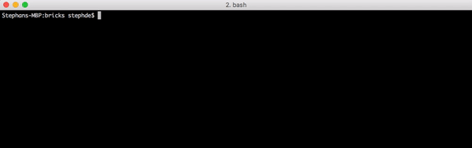
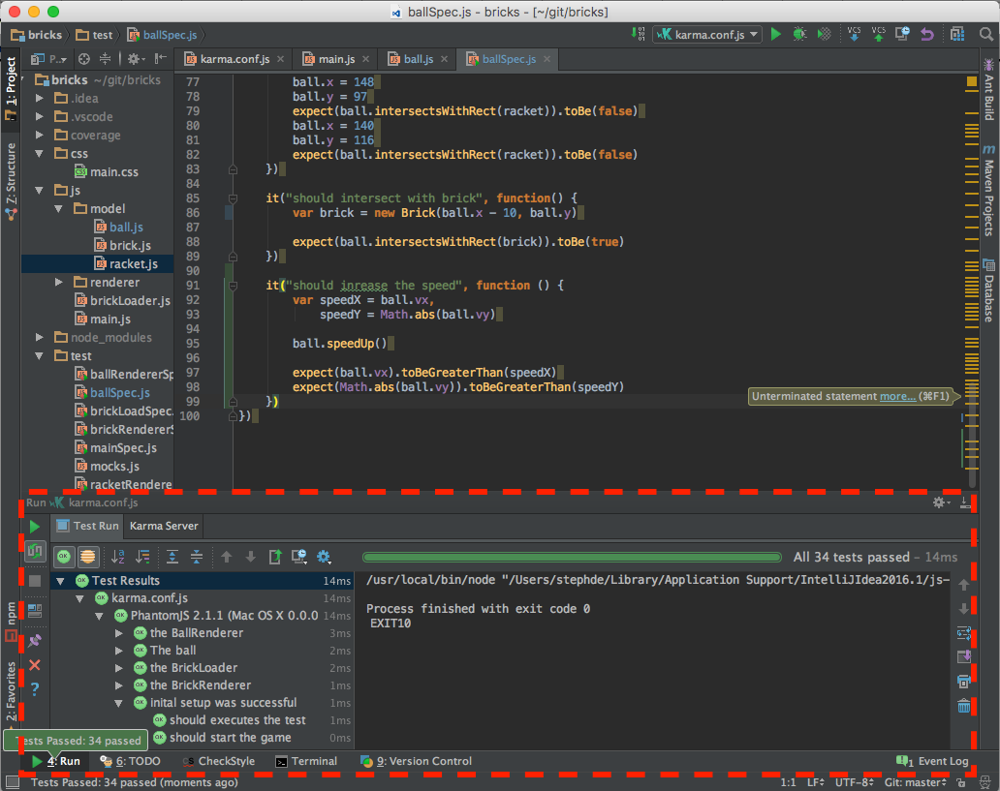
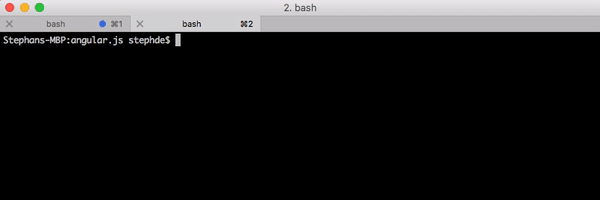
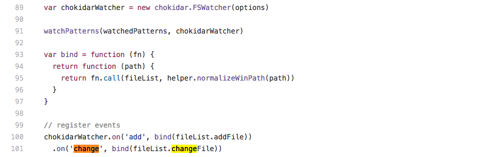
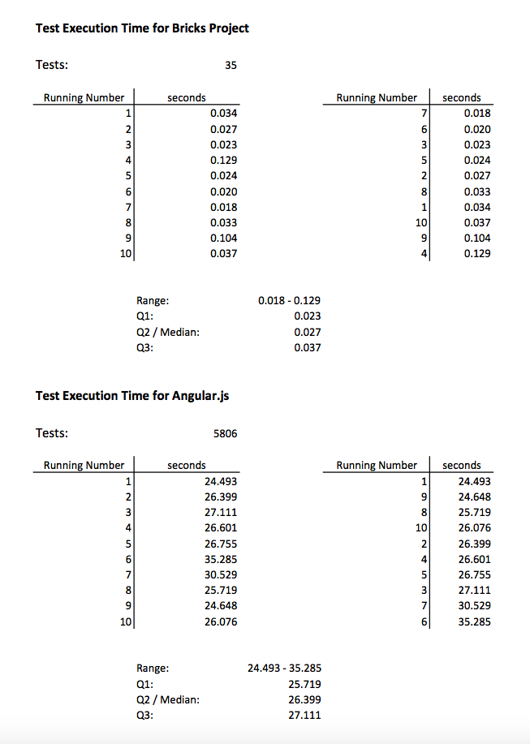

# Live Programming Seminar
- Your Name: Stephan Detje
- Your Topic: Karma


## About the System itself
### Summary of system properties

Karma is a tool for automatic test execution on JavaScript code.  It was build by the developers of AngularJS. They did not find a test execution framework which satisfied their needs, so they decided to build one themselves. They believe that "...quick feedback is what makes you productive and creative." @RefKey[GitHubKarma]

Karma is a based on nodejs and used to test javascript modules. Its main objective is giving live feedback on test results. Aims to be very easy and intuitive to set up. On first start a configuration can be generated. Karma offers integration with the most popular build tools for node models, e.g. grunt and gulp. Moreover, the actual testing and assertion libraries are interchangeable, so the developer can choose his favorite, e.g. mocha, Jasmine or QUnit. Additionally, Karma also offers the possibility to execute tests in multiple browsers. Besides running the test, Karma can also calculate a coverage report. It can either be displayed in an IDE window or saved as a HTML file.

Furthermore, Karma is aivalable as open source, so anyone can contribute. There is an active community around it, which continuously strives to improve it.

### System boundaries

In general Karma can be used with any editor or IDE. Some IDEs like Webstorm have a plugin available for download, which makes the usage of Karma more convenient. Webstorm can display test results and the coverage report in a very appealing way. However, Karma can be used with any IDE which has a terminal. Any other editor can be used as well in combination with an external terminal window.


*Screenshot of Webstorm IDE with Karma integration, source: https://confluence.jetbrains.com/download/attachments/51966353/Karma-testresults.png*

For the purpose of this analysis I am using two different set-ups. On the on hand visual code for development with a terminal window on a second screen which continuously runs the karma runner. On the other hand intelliJ with the Karma plugin. For both setups Karma runs a headless phantomJS browser to execute the tests in.


### Context

Karma is used for application development. To be more specific, for realtime testing while developing an application. Since continous testing is central in agile development Karma will mostly be found in agile projects. It supports many points of the agile manifesto like test-driven development (TDD) and continous integration and can therefore be a very useful tool. Thus, the users of Karma are mostly professional developers. Karma is also very useful for debugging and refactoring software, since immediate feedback about the test results is important for these activities.

### General Application Domain

The main results produced by Karma are test results. Moreover, it displays execution time and can also generate an html document which contains a coverage report. If integrated in Webstorm the coverage reports can also be displayed directly in the IDE.

The main benefit for the users of Karma is live feedback on test results. The users aim to get feedback on whether their code works well as fast as possible, ideally even instantly. This should help them to increase their efficiency and to be more productive. It should also support them in developing better and more robust applications by identifying untested code through the coverage report. In general all of the beforementioned points support a test-driven development workflow. Furthermore, it helps them to worry less about their tools with features like auto configuration.

Since Karma is used for application development with JavaScript it is applied in the same application domains as JavaScript. Therefore, Karma is mainly used for web applications and applications with client-server architecture. However, it is specialised on unit testing. In order to include other test layers like end-to-end tests in the application other frameworks have to be included (e.g. Protractor or Nightwatch.js).


### Design Goals of the System

Auto-Testing tools in general are designed to improve the developers workflow for TDD. Therefore, one design goal of Karma is to provide test results as fast as posssible. This gives the developers more confidence while they are writing code, since they will know immediately whether their changes break current implementations. On the GitHub page of Karma they summarize the purpose of Karma as follows: "The main purpose of Karma is to make your test-driven development easy, fast, and fun." 
@RefKey[GitHubKarma]

In general the main design rational of Karma is to give the developers less to worry about. To achieve this, simple configuration is important for Karma. The users should not get additional overhead when using it. In the end all of this is supposed to make the developer more productive and efficient, while also increasing code quality.

<!-- - continuous Integration -->


### Type of System

As mentioned earlier Karma is an automatic testing tool. Therefore, it is not part of any language or execution environment. It can execute tests automatically and calculate coverage reports and can be used in addition to your development setup in order to get faster feedback from tests.

---

## Workflows

### Example Workflow

#### Setup IDE / editor
There are two possible setups in which Karma can be used. The first one is to use the IDE integration e.g. with intelliJ. The other is to have Karma running in its own terminal window and use any editor to write the code.

When using the first one the setup can be done in the IDE. The Karma IDE plugin has to be installed first. Then a Karma configuration file has to be created.  If this file is available it can be executed. The IDE will then automatically open a test window on the bottom. This window contains some buttons to run, stop and configure Karma and will also display test results.

If Karma is run in a separate terminal window the setup is slightly different. The package has to be installed via npm as shown in the gif below.  Afterwards the creation of a config file can be started by running `karma init`. After executing this command a few questions about the usage preferences of Karma have to be answered. At the end this will create a Karma configuration file. When this is done additional changes to the config can be made. Then Karma can be run with `karma start path/to/config.js`.

In order to use Karma coverage reports for either setup an additional package/plugin has to be installed.



*Setting up and running Karma in terminal*


#### Standard workflow

When the system has been set up as described in the previous section Karma can be used very easily. Once Karma is started, it immediately begins to run the tests for your code as specified in the configuration. Every time changes are applied to your code base the test are rerun. Karma will display the results for your test then.

The standard workflow would be to save changes on the code. Right afterwards looking at the test results to find out whether the changes broke any test. If that is the case the changes (or test) have to adjusted so that all test pass again. Then new changes can be applied and the workflow starts over. This workflow is display in the screencast - as shown below? - .

- ToDo: describe workflow and add screencast as extra file

### Which activities are made live by which mechanisms?


The main activity in Karma is giving feedback about the test results to the users. The feedback mechanism is made live by employing multiple liveness patterns. By running the tests and thus updating the test results on every save, the user gets the impression that the tests are constantly running all the time. This enables seemingly live feedback. The streaming pattern is applied to shorten the emergence phase. This is done by displaying partial test results while the rest of the tests are still being executed.

Moreover, color coding is used to make test failures more recognizable. When the tests are run successful the result is displayed in green, whereas failed tests and error messages are printed in red. Therefore, the user does not need to reed the actual output in order to know the overall result.


### Integration of live activities into overall system
Which activities in the system are not interactive anymore? Which elements can be manipulated in a live fashion and which can not?

While Karma is running the code and the tests can be modified and the changes will be included in the live feedback. A restart of karma is not necessary for this. However, all changes that required adjustments in the configuration of Karma require a restart. An example for this is adding a new source file which is not yet watched by the filewatcher. However, for files in folders that are included with a wildcard this is not necessary. Similarly, changing karma to include a coverage report requires a change in its configuration and therefore a restart has to be done.


### Limitations
At a ceratin number of tests the execution time is too long to be considered live. For my setup the execution of approximately 500 tests takes roughly 3 seconds. This is the line where the liveness starts to vanish. However, this highly depends on the tests and the hardware they are executed on. Therefore, no general number can be given. Very complex tests (using loops or complicated calculations) can also have a big impact on the time needed for execution and therefore influence the liveness.

Besides runtime there are also some other limitations in Karma. When code changes are saved while the tests are still running, the reexecution will be queued and thus delayed until the current run is completed. This breaks the liveness and can lead to misinterpretation of the results, because the user may not be certain whether the changes he made were already included in the current test run.

Furthermore, Karma does not support smart test execution. As a result it can only execute the entire test suite. It cannot automatically run only tests which are affected by the saved changes. If this was possible the execution time would be cut down vastly and hence the liveness be improved.


### What happens when the live parts of the system fail/break?

The most common exception in a test runner is a failed test due to an assertion error. This will not break the system and just cause Karma to print a message. However, when the tests have syntax errors this can sometimes cause the command line runner to crash. The IDE plugin for intelliJ however, handles this better and is restarted automatically by the IDE so that the user does not notice this.

The tool itself can be caused to crash when a falsy configuration is used. The crash will happen immediately after the startup so, that it can be fixed right away and does not cause any side effects.

When using Karma with a headful browser there will be a visible browser application window on the desktop. This can be closed manually. Anyway, this does not affect the execution, since Karma will just restart the browser.

### Left out features
Karma also support execution in multiple browsers. However, we will not dive deeper into this feature, because it is not relevant for evaluating the liveness.

---

## Models

### Mutable or immutable past
<!-- To which category does the system or parts of it belong and why? -->
The Karma test runner belongs to the category of mutable past. For every test run that is triggered by Karma it replays all tests. Therefore, the recent changes are applied to all tests. This gives the impression, that this changes had been applied in the past. Thus, Karma gives the impression of a mutable past.

- code changes during execution are deferred

*P. Rein and S. Lehmann and Toni & R. Hirschfeld How Live Are Live Programming Systems?: Benchmarking the Response Times of Live Programming Environments Proceedings of the Programming Experience Workshop (PX/16) 2016, ACM, 2016, 1-8*


### Tanimoto's Level of Live Programming

According to Tanimoto a program has to be informative, significant and responsive to be classified as level 3 liveness. This includes for example edit triggered updates, where the programmer does not have to trigger the updates manually. In order to be classified as level 4 the responses have to be delivered more or less instantly (live).

Depending on the setup and environment Karma can be classified as either of those levels. Karma shows results everytime changes on the code are saved, without the programmer having to trigger Karma manually again. Thus, it can be classified as level 3.

However, when using the IDE setup in combination with automatic saving of changes the results are delivered live. This also depends on the execution time of the tests. Execution time for one test cycle highly depends on a number of factors:

* number of tests
* complexity of tests
* lines of code
* coverage reporting
* general configuration of Karma (e.g. which reporter is used)

With the right setup, test results can be given really fast (less than a second), so seamingly instant for humans. Even though the tests are not running all the time, the user gets the impression that they do. In this scenario Karma can be classified as liveness level 4 in regard to Tanimoto, since it gives live updates.


*S. L. Tanimoto A perspective on the evolution of live programming Proceedings of the 1st International Workshop on Live Programming, LIVE 2013, 2013, 31-34*

### Steady Frame
<!-- Which activities are designed as steady frames based on the formal definition and how? -->

If Karma is run in the terminal it does not provide any steady frames. It simply prints new lines in the terminal for every test run.

However, if the IDE integration is used (e.g. in intelliJ) windows for test results and coverage report are constantly displayed (as shown in the picutre in section System Boundaries). The coverage window is a steady frame which updates the percentages numbers of covered files and lines on every test run. The test window is somewhat steady as well. However, the displayed content may change depending on success and failure of tests.

The picture below shows the test window in intelliJ marked with red. The green bar which displays the status of the execution (with how much of it is filled) and the overall test result (with color) is allways visible. The general structure of the window also always remains the same. However, the content of the two smaller windows change in respect of which tests pass and which fail.



*Karma as steady frame in intelliJ*

*C. M. Hancock Real-Time Programming and the Big Ideas of Computational Literacy Massachusetts Institute of Technology, Massachusetts Institute of Technology, 2003*

### Impact on distances
<!-- temporal -->
Keeping the temporal distance low is very important to Karma. In order to work properly with it, the test results have to be delivered fast. This is important because the developer needs to know which exact change breaks a test.

<!-- spatial -->
The spatial distance between changes that are made and the results shown by Karma depends on the actual setup. When Karma is used with IDE integration (such as intelliJ) the spatial distance is low. The result window is located right below the editor and allways visible. However, this could this be improved as described in section Personal Observations.

When Karma is used in a separate terminal window the distance is slightly bigger. However, this depends on how it us used. The terminal window can be put right next to the editor window on the screen and will therefore still be visible all the time.

<!-- semantic -->
Semantic depends the effort or necessary actions to take in order to get to the results. If Karma is in auto run mode no additional action by the programmer are necessary to get the results, since tests are triggered automatically. Thus, semantic distance is really low in Karma.

*D. Ungar and H. Lieberman & C. Fry Debugging and the Experience of Immediacy Communications of the ACM, ACM, 1997, 40, 38-43*

---

## Implementing Liveness

### Extend of liveness in technical artifacts
What parts of the system implements the liveness? (Execution environment, library, tool...)
- the tool !?

### Implementations of single activities
Description of the implementation of live activities. Each implementation pattern should be described through its concrete incarnation in the system (including detailed and specific code or code references) and as an abstract concept.

<!--
#### Example: Scrubbing
The mouse event in the editor is captured and if the underlying AST element allows for scrubbing a slider is rendered. On changing the slider the value in the source code is adjusted, the method including the value is recompiled. After the method was compiled and installed in the class, the execution continues. When the method is executed during stepping the effects of the modified value become apparent.

Abstract form: Scrubbing is enabled through incremental compilation which enables quick recompilation of parts of an application...
-->
#### Streaming
When the test execution is triggered partial results are shown immediately. The console (or IDE plugin) displays the number of tests which have been executed successfully already. Furthermore, the total number of tests which are to be run is shown. If any tests have failed the signature of those is displayed as well.



*Streaming of partial test results and progress in Karma*


#### Update on save
Karma uses a filewatcher to capture changes on all files specified in the configuration. Every time a change event is recognized, all the tests are reexecuted. Karma uses the chokidar filewatcher package to implement this. As shown below Karma attaches to all *add* and *change* events on files in the pathes specified in its configuration.



*FileWatcher initialization in Karma @RefKey(karmaFileWatcher)*

#### Evaluation of multiple examples
As described in the workflow section, Karma uses the tests as code examples. These examples are than used to execute the tests. Therefore it runs and evaluates the program under different preconditions.

### Within or outside of the application
The activities are trigger from outside of the application. Possible triggers can be changing a file, adding a new file or removing a file. As described before Karma listens to these events with a filewatcher and triggers the test run when they occur.

---

## Benchmark
1. **Unit of change:** 
<!--
Determine relevant units of change from the user perspective. Use the most common ones.
-->

- files
- lines of code

2. **Relevant operations:** 
<!--
Determine relevant operations on these units of change (add, modify, delete, compound operations (for example refactorings)).
-->

- modify source code
- modify tests

3. **Example data:** 
<!--
Select, describe, and provide representative code samples which reflect the complexity or length of a common unit of change of the environment. 
The sample should also work in combination with any emergence mechanisms of the environment, for example a replay system works well for a system with user inputs and does not match a long-running computation.
-->

A typical change would be adding a new test to the test suite. The new test will then automatically be executed with the other tests, once it has been saved. When using jasmine as test library tests usually look similar as shown below in pseudo code. Other changes could be any modification on the code or tests.

```js
it("should test that something is true", function() {
  var something = new Something()
  something.doIt()
  expect(something.result).toBe(true)
})
```


4. **Reproducible setup of system and benchmark**

In order to understand the affect of the size of a code base on the performance of Karma, the benchmark includes numbers for a big and a small system. The big system is the AngularJS framework. The small one is a simple javascript browser game called bricks. The properties of both systems are displayed in the table below.

 Property | AngularJS | Bricks 
--- | --- | --- 
Commits | ~8300 | ~25 
Contributors | ~1500 | 1
Tests | ~5800 | ~35
Website | [AngularJS](https://github.com/angular/angular.js) | [Bricks](https://github.com/stephde/bricks)


  1. Description of installation on Ubuntu 16.04.1 LTS

  AngularJS
  - install node/npm
  - `git clone https://github.com/angular/angular.js.git`
  - `npm install -g grunt-cli`
  - `cd angular.js && npm install`
  - `grunt autotest`

  Bricks
  - install node/npm
  - `git clone https://github.com/stephde/bricks.git`
  - `cd bricks && npm install`
  - `karma start karma.conf.js`

  2. Description of instrumentation of system for measurements: The measurements should be taken as if a user was actually using a system. 
  So the starting point of a measurement might be the keyboard event of the save keyboard shortcut or the event handler of a save button. 
  At the same time the emergence phase ends when the rendering has finished and the result is perceivable. 
  The run should include all activities which would be triggered when a developer saves a unit of change (for example regarding logging or persisting changes).


5. **Results for adaptation and emergence phase**

### adaptation phase
For Karma the adaption phase is everything that happens before starting the test run. Once the application is started this phase is basically not noticeable for the user. The application startup itself can take a few seconds. However, this is only done once before starting to actually modify the code. Therefore the adaptation phase is not farther inspected in this benchmark.

### emergence phase:
In order to trigger the test execution I made a minor change in the code, by flipping the return value of a tests function from true to false. This caused a few tests to fail. Afterwards, I flipped it back to the original value and after reexection the test passed again. This was repeated five times.

This procedure was performed on both sample systems. When printing the test results, Karma also prints the time it took to execute the tests. From these times the median and quartiles can be calculated. As expected the median execution time for the larger project is much higher (26.399 seconds) in comparison to the smaller project (0,027). For angular the range was also significantly wider with 24 to 35 seconds compared to 0.018 to 0.129 seconds. The full benchmark results can be found in the Appendix section.

In conclusion Karma can be considered live when used in the context of the small Bricks project. However, when using it for the large AngularJS code base with more than 5000 tests this is not the case.

*P. Rein and S. Lehmann and Toni & R. Hirschfeld How Live Are Live Programming Systems?: Benchmarking the Response Times of Live Programming Environments Proceedings of the Programming Experience Workshop (PX/16) 2016, ACM, 2016, 1-8*

---

## Personal observations
I think the liveness in Karma could be increase further. One way to achieve this is by decreasing the spatial distance of test results to the code. This for example done in Wallaby.js. The test results are displayed as a green or red dot in the IDE directly to the specific test.
@RefKey(Wallabyjs)


## Appendix



*Benchmark for Bricks and AngularJS*

<!--
## Style Template
- Denote headings with #
- You can use any text highlighting, list types, and tables
- Insert images in the following way:
  ``
- Insert videos or web resources as markdown links
- Insert references as: `@RefKey` and supply a bib file
- No HTML tags please
-->