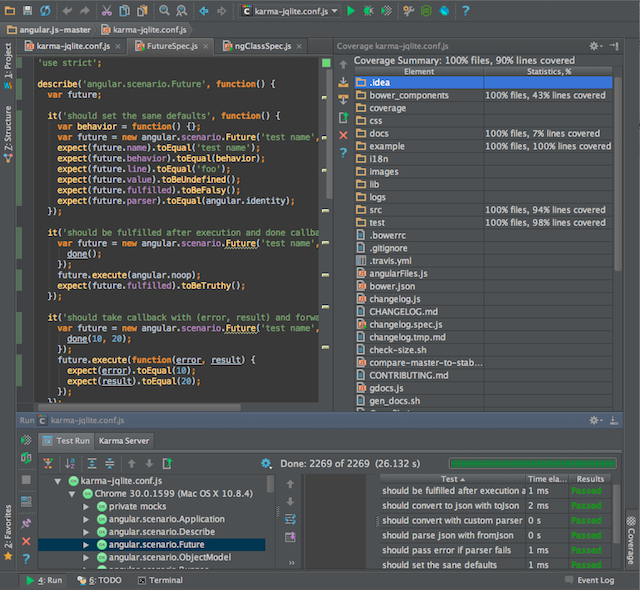

# Live Programming Seminar
- Your Name: Stephan Detje
- Your Topic: Karma

<!--
Generally try to drill down on reasons behind properties of the system. Make use of the general observations about the system in arguing about specific properties or mechanisms.
-->

## About the System itself
### Summary of system properties

Karma is a tool for automatic test execution on JavaScript code. 
It was build by the developers of AngularJS.
They did not find a test execution framework which satisfied their needs, so they decided to build on themselves.
They believe that "...quick feedback is what makes you productive and creative." @RefKey[GitHubKarma]

Karma is a based on nodejs and used to test javascript modules.
Its main objective is giving live feedback on test results.
It is very easy and intuitive to set up.
On first start a configuration can be generated.
Karma offers integration with the most popular build tools for node models, e.g. grunt and gulp.
Moreover, the actual testing library is interchangeable, so the developer can choose his favorite, e.g. mocha, Jasmine or QUinit.
Besides support for unit tests karma also offers the possibility to execute tests in multiple browsers.
Karma can also calculate a coverage support which can be displayed in multiple formats.

Furthermore, karma has is aivalable as open source, so anyone can contribute.
There is an active community which continuously strives to improve it.

### System boundaries
<!--
What have you looked at exactly? Mention the boundaries of the system and state what is included and excluded. For example, in Chrome the system might be the developer tools. This ignores any JavaScript libraries which might add additional live capabilities to the tools or to the page currently developed. Another example are auto-testing setups which span a particular editor, testing framework, and auto-testing tool.
-->

In general karma can be used with any editor or IDE.
It is integrated in some IDEs like Webstorm.
Webstorm can display test results and the coverage report in a very appealing way.
However, karma can be used with any IDE which has a terminal.
Any other editor can be used as well in combination with an external terminal window.

*Screenshot of Webstorm IDE with karma integration, source: https://confluence.jetbrains.com/download/attachments/51966353/karma-testresults.png*

I am using visual code for development.
Additionally I have a terminal window on a second screen which continuously runs the karama runner.
Karma also runs a headless ?chromium? browser to execute the tests in.

### Context
<!--  
  - In which context is the system used?
    For example: Application development (coding, debugging, exploration), education, art, science (data exploration), simulation, exploration of ideas or data.
  - Description of user context (professional, amateur, public presentation in front of audience, (un)known requirements, children, ...)
-->

Karma is used for application development. 
To be more specific, for realtime testing while developing the application.
Since continous testing is central in agile development karma will mostly be found in agile projects.
It supports many points of the agile manifesto like test-driven development (TDD) and continous integration and can therefore be a very useful tool.
Thus, the users of Karma are mostly professional developers.

### General Application Domain
<!-- What is typically created in or through this system? -->

The main results produced by karma are test results.
It can show results for single or multiple tests.
Moreover, it displays execution time.
Furthermore, it can generate an html document which contains a coverage report.
If integrated in Webstorm it coverage reports can also be displayed directly in the IDE.

<!-- What are users trying to accomplish with it? -->
The main benefit for the users of karma is live feedback on test results.
The users aim to get feedback on whether their code works well as fast as possible, if possible even instantly.
This should help them to increase their efficiency and be more productive.
It should also support them in developing better and more robust application by identifying untested code through the coverage report.
In general all of the beforementioned points support a test-driven development workflow.
Furthermore, it helps them to worry less about their tools with features like auto configuration.

<!-- 
What kind of systems are modified or developed with it (graphical application, client-server architecture, big data, streaming)?
-->
Since karma is used for application development with JavaScript it is applied in the same application domains as JavaScript is.
Therefore, karma is mainly used for web applications and applications with client-server architecture. 

### Design Goals of the System
<!--
What is the design rational behind the system? Which values are supported by the system? Which parts of the system reflect this rational? For example, auto-testing setups are designed to improve productivity by improving the workflow for TDD through providing feedback on the overall system behavior during programming. Smalltalk systems are designed for expressiveness and enabling understanding through allowing users to directly access and manipulate all runtime objects in the system.
 -->

Auto-Testing tools in general are designed to improve the developers workflow for TDD.
Therefore, one design goal of Karma is to provide test results as fast as posssible.
This gives the developers more confidence while they are writing code, since they will know immediately whether their changes break current implementations.
On the GitHub page of karma they summarize the purpose of karma as follows:
"The main purpose of Karma is to make your test-driven development easy, fast, and fun." 
@RefKey[GitHubKarma]

In general the main design rational of karma is to give the developers less to worry about.
To achieve this, simple configuration is important for karma.
The users should not get additional overhead when using it.
In the end all of this is supposed to make the developer more productive and efficient, while also increasing code quality.

<!-- - continuous Integration -->

### Type of System
<!--
What is the general nature of the system? For example: interactive tool, system, library, language, execution environment, application. What makes the system part of that category?
it is important that it is a tool
no runtime, no language
-->

As mentioned earlier karma is an automatic testing tool.
Therefore, it is not part of any language or execution environment.
It can execute tests automatically and calculate coverage reports and can be used additionally to your development setup in order to get faster feedback from tests.

---

## Workflows
Summary of workflow observations

### Example Workflow
Description of the major workflow which illustrates all relevant "live programming" features. The workflow description should cover all major elements and interactions available. Augmented by annotated pictures and screencast.

work setup
- need multiple screens for live feedback
- otherwise change screen (not that live)

- setup karma ?

- start karma runner
- write test
- add code
- test switches to green
- change test
- test switches to red

- add screencast

### Which activities are made live by which mechanisms?
Description of each concrete activity in the workflow and the underlying liveness mechanism (which is described on a conceptual level and thus could be mapped to other systems)

--> ui perspective. get workflow first

- Actual interactions
- Feedback mechanism
  * live feedback
  * on code changes there is "instantly" a feedback wether the code works
  *
- If applicable: How is the emergence phase shortened?
  * what does this mean?
  * emergence is shortened by displaying partial results earlier
  * if it had smart test execution
- Granularity: For example: Elm can only rerun the complete application

### Integration of live activities into overall system
Which activities in the system are not interactive anymore? Which elements can be manipulated in a live fashion and which can not?
 - test results can be manipulated

 - karma confoguration can not be changed during runtime
 - cannot add coverage report live
 - cannot add files dynamically? or only new directories?

How does this workflow integrate with other parts of the system (potentially not live)? What happens at the boundaries between live parts and non-live parts? For example, the interactively assembled GUI is later passed to a compiler which creates an executable form of the GUI.

### Limitations
To which extend can the liveness of one activity be kept up? For example, at which magnitude of data flow nodes does the propagation of values become non-immediate? At which magnitude of elapsed time can the Elm debugger not replay the application immediately anymore or when does it break down? Does an exception break the liveness?
Further, what are conceptual limitations. For example, in a bi-directional mapping system properties of single elements might be modified and reflected in the code. This might not be possible for properties of elements created in loops.
- how many tests necessary to break liveness?
- can complex tests break liveness?
- multiple reports to break liveness?
- how das coverage in general affect liveness?
- when tests are still running and changes are made, restart is delayed
- verbose output after first failure causes longer execution time for standard reporter (in case of angular + 2min)
- --> needs extra adjustment
- cannot alter code during test execution

### What happens when the live parts of the system fail/break?
1. What happens when the application under development causes an exception? How does the system handle these exceptions (provide debugger, stop execution, stop rendering, ...)? Does the liveness extend to these exceptions?
- failed test is no problem
- logical errors are handled
- syntax errors causes tool breakdown (restart necessary)
- missing object / file breaks execution
  * restart necessary after that?
2. How can the system itself break? What happens when there is a failure in the system/tool itself?
- falsy configuration
- depending on the falt immediate or deferred breakdown

### Left out features
Which features of the system were not described and why were they left out?
- multi browser support ? - not relevant?2

---

## Models

### Mutable or immutable past
<!-- To which category does the system or parts of it belong and why? -->
The Karma test runner belongs to the category of mutable past.
For every test run that is triggered by Karma it replays all tests.
Therefore, the recent changes are applied to all tests.
This gives the impression, that this changes had been applied in the past.
Thus, karma gives the impression of a mutable past.

*P. Rein and S. Lehmann and Toni & R. Hirschfeld How Live Are Live Programming Systems?: Benchmarking the Response Times of Live Programming Environments Proceedings of the Programming Experience Workshop (PX/16) 2016, ACM, 2016, 1-8*

### Tanimoto's Level of Live Programming
To which level of liveness do single activities belong, based on the definitions of the 2013 paper and why?

- level 1: informative
   * e.g. flowchart as ancilly description)
- level 2: informative and significant
   * e.g. executable flowchart
   * response is manually triggered by the programmer
   * response is not immediate
- level 3: informative, significant and responsive
   * e.g. edit-triggered updates
   * response is automatically triggered without the programmer doing so manually
   * response is not immediate
   * edit program while it is running
- level 4: informative, significant, responsive and live
   * e.g. stream-driven updates
   * response is triggered as soon as changes are saved
- level 5: totally predictive:
   * adds Programming via selection from running predicted behavior
   * environment is ahead of the programmer

- karma should be at level 3
   * does executes the test as soon as changes are saved, but only on save?
   * if you do not save there are no live updates
   * cannot edit program while running (cannot actually edit program)
   * only level 4 with autosaving IDE?
   * only level 4 when response time is acceptable?
   * could have tests run continuously
   * cannot predict anything, so not level 5...

*S. L. Tanimoto A perspective on the evolution of live programming Proceedings of the 1st International Workshop on Live Programming, LIVE 2013, 2013, 31-34*

### Steady Frame
<!-- Which activities are designed as steady frames based on the formal definition and how? -->

If karma is run in the terminal it does not provide any steady frames.
It simply prints new lines in the terminal for every test run.

However, if the IDE integration is used (e.g. in intelliJ) windows for test results and coverage report are constantly displayed (as shown in the picutre in section System Boundaries).
The coverage window is a steady frame which updates the percentages numbers of covered files and lines on every test run.
The test window is somewhat steady as well.
However, the displayed content may change depending on success and failure of tests.

* What about the browser (if headfull?)

*C. M. Hancock Real-Time Programming and the Big Ideas of Computational Literacy Massachusetts Institute of Technology, Massachusetts Institute of Technology, 2003*

### Impact on distances
How do the activities affect the different distances: temporal, spatial, semantic?

- which activities?

- temporal
  * is very important
  * fast feedback on test results
  * so the developer knows which exact change caused the break

- spatial
  * distance on screen
  * when using Webstorm distance is smaller
  * when using second screen distance is high (but ok)
  * popup over code would be much nicer
  * depends on setup of the user
  * show tests as pop-up on code

- semantic
  * not high
  * in good setup, no clicks required to see effect

  --> how many context changes?
  --> nothing to do

*D. Ungar and H. Lieberman & C. Fry Debugging and the Experience of Immediacy Communications of the ACM, ACM, 1997, 40, 38-43*

---

## Implementing Liveness

### Extend of liveness in technical artifacts
What parts of the system implements the liveness? (Execution environment, library, tool...)
- the tool !?

### Implementations of single activities
Description of the implementation of live activities. Each implementation pattern should be described through its concrete incarnation in the system (including detailed and specific code or code references) and as an abstract concept.

<!--
#### Example: Scrubbing
The mouse event in the editor is captured and if the underlying AST element allows for scrubbing a slider is rendered. On changing the slider the value in the source code is adjusted, the method including the value is recompiled. After the method was compiled and installed in the class, the execution continues. When the method is executed during stepping the effects of the modified value become apparent.

Abstract form: Scrubbing is enabled through incremental compilation which enables quick recompilation of parts of an application...
-->
#### Streaming
When the test execution is triggered partial results are shown immediately.
The console (or IDE plugin) displays the number of tests which have been executed successfully already.
Furthermore, the total number of tests which are to be run is shown.
If any tests have failed the signature of those is displayed as well.

*Streaming of partial test results and progress in Karma*

#### Update on save
Karma uses a filewatcher to capture changes on all files specified in the configuration.
Every time a change event is recognized, all the tests are reexecuted.

#### Evalutaion on multiple examples
  - test = examples

### Within or outside of the application
For each activity: Does the activity happen from within the running application or is it made possible from something outside of the application? For example, a REPL works within a running process while the interactions with an auto test runner are based on re-running the application from the outside without any interactive access to process internal data.

---

## Benchmark
1. **Unit of change:** Determine relevant units of change from the user perspective. Use the most common ones.
- successful / failed / erronous tests
- number of executed tests
- execution system (cross browser testing)
- execution time?

2. **Relevant operations:** Determine relevant operations on these units of change (add, modify, delete, compound operations (for example refactorings)).
- ?
- fix tests to change stats?

3. **Example data:** Select, describe, and provide representative code samples which reflect the complexity or length of a common unit of change of the environment. 
The sample should also work in combination with any emergence mechanisms of the environment, for example a replay system works well for a system with user inputs and does not match a long-running computation.

Benchmark System properties
  - angular suite
  - ~8200 commits on master branch (as of Dec. 2016)
  - ~1500 contributors
  - ~5806 tests
  - ~191k lines of code
  - huge project

4. **Reproducible setup of system and benchmark**
  1. Description of installation on Ubuntu 16.04.1 LTS
  - install node/npm
  - clone angular repository
  - install grunt-cli (using npm)
  - npm install in angular repository
  - exectue grunt autotest to run test continuously
  - start making changes on the code

  2. Description of instrumentation of system for measurements: The measurements should be taken as if a user was actually using a system. 
  So the starting point of a measurement might be the keyboard event of the save keyboard shortcut or the event handler of a save button. 
  At the same time the emergence phase ends when the rendering has finished and the result is perceivable. 
  The run should include all activities which would be triggered when a developer saves a unit of change (for example regarding logging or persisting changes).

5. **Results for adaptation and emergence phase**

### adaptation phase
- compilation
- time till tests are reexecuted

### emergence phase:
- first execution ~31s
- first change ~26s
- second change ~24s
- third change ~25s
- 4th change ~25s
- 5th change ~26s, 98 test failed, first failed test after ~17s
--> not live anymore (response time to high)
--> can create specific configs though (for smaller parts of the system --> better performance)

--> first responce
--> is there a difference between making changces in tests or code?

## Benchmark 2 - smaller system
- bricks game
- < 100 commits
- < 100 tests

- < x lines of code

*P. Rein and S. Lehmann and Toni & R. Hirschfeld How Live Are Live Programming Systems?: Benchmarking the Response Times of Live Programming Environments Proceedings of the Programming Experience Workshop (PX/16) 2016, ACM, 2016, 1-8*

---

## Personal observations
Everything that is particular about the environment and does not fit into the pre-defined categories mentioned so far.
- I would like to have the spatial distance decreased in the IDE
- get a popup next to the test instead of having the test window open all the time

## Style Template
- Denote headings with #
- You can use any text highlighting, list types, and tables
- Insert images in the following way:
  ``
- Insert videos or web resources as markdown links
- Insert references as: `@RefKey` and supply a bib file
- No HTML tags please

## My Questions
- Image Sources?
--> url und timestamp after picture
- @RefKey ?
-> dont worry
- steady frame?
--> page 58
--> folien
- temporal, spatial, semantic distance?

new
- can i leave out "extend of liveness in technical artifacts (cause its obvious) ?
- is this enough for update on save, streaming, etc. ?
- steady frame with headfull browser?